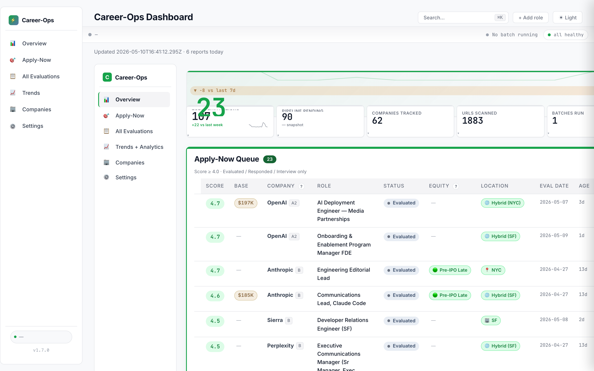
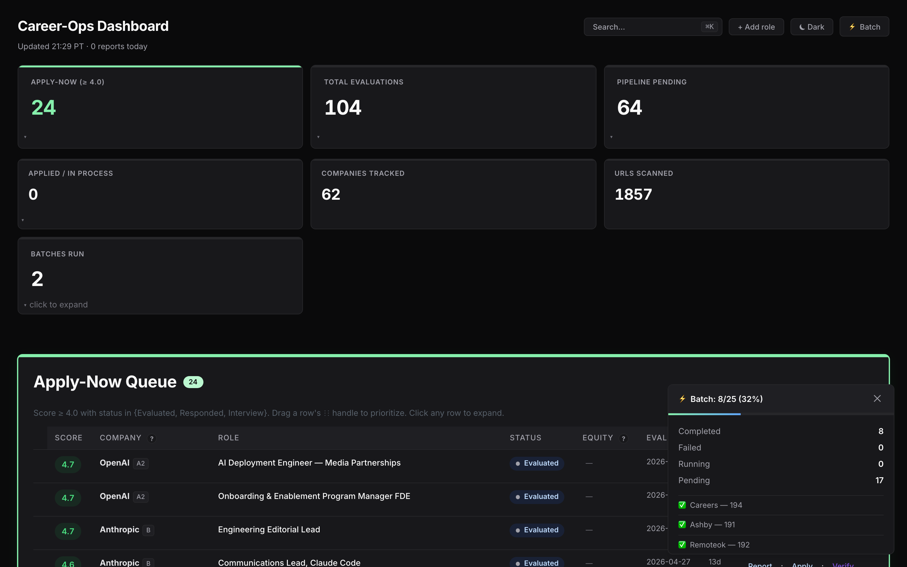
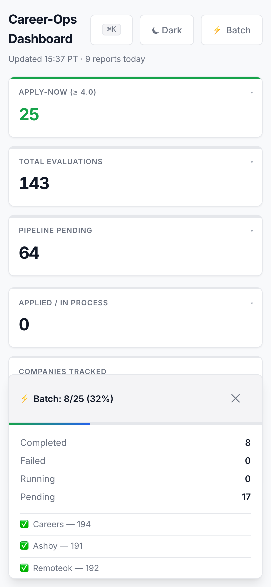

# career-ops — Mitchell Williams's fork



I forked [santifer's open-source career-ops](https://github.com/santifer/career-ops) to run my own AI-native job search. This is the production deployment — a live dashboard, an autonomous batch worker, and a tunnel-fronted PWA I use day-to-day.

## What I built on top

- **Cloudflare Tunnel + Access** — single-user OTP auth, no port forwarding, Cloudflare TLS at the edge
- **Cmd-K command palette** — instant search across applications, reports, and queue actions
- **Mobile cards + drawer** — responsive table collapses to scannable cards on phones
- **Status writeback** — inline status edits round-trip to `applications.md` from the browser
- **Batch history view** — every batch run, its cost, advance rate, and failure surface
- **Expand-row hierarchy** — drill from row to report to underlying JD without leaving the table
- **Search across reports** — full-text query over every evaluation
- **WCAG 2.1 AA cleanup** — contrast, focus rings, skip links, axe-clean
- **PWA install** — installs to the home screen on iOS and Android, offline-tolerant shell
- **Custom favicon + dark mode** — green live-dot monogram, system-aware theme
- **Demo screenshot capture** — 4 viewports × light/dark/full via Playwright
- **Equity-signals automation** — pre-IPO signals scraped and scored per offer
- **Career-library archive** — every report, JD snapshot, and outreach thread preserved
- **Telegram bot integration** — push alerts from the batch worker to my phone
- **Weekly Phase worker** — autonomous feature shipping on a cadence

## Live screenshots

| Light (1440px) | Dark (1440px) | Mobile (iPhone) |
|---|---|---|
|  |  |  |

## Architecture

- **Backend** — Node.js HTTP server (`dashboard-server.mjs`), live filesystem reads against `data/applications.md` and `batch/batch-state.tsv`
- **Frontend** — vanilla JS with CSS tokens, no build step
- **Build** — Playwright for screenshots and PDF generation
- **Hosting** — Cloudflare Tunnel (`cloudflared`) terminating at the local Mac
- **Scheduling** — `launchd` LaunchAgents for the batch worker, scanner, heartbeat, and tunnel

## Run locally

```bash
git clone https://github.com/mitwilli-create/career-ops.git
cd career-ops && npm install
npx playwright install chromium
cp config/profile.example.yml config/profile.yml
node dashboard-server.mjs --port=3000
```

## Credit

Built on top of [santifer/career-ops](https://github.com/santifer/career-ops) — original system, scoring logic, modes, and CV pipeline by [Santiago Fernandez](https://santifer.io). MIT licensed; the original [LICENSE](LICENSE) and [TRADEMARK.md](TRADEMARK.md) are preserved unchanged.

## Contact

[mitwilli@gmail.com](mailto:mitwilli@gmail.com) · [LinkedIn](https://linkedin.com/in/mitwilli)
