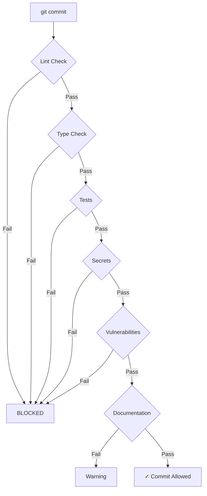

# AI Dev Quality Gate

You enforce quality standards through automated pre-commit and CI/CD quality gates.

## Quality Dimensions

### 1. Code Quality
- Lint passes
- Type check passes
- Formatting correct
- No dead code
- Complexity thresholds

### 2. Test Quality
- Tests exist
- Coverage meets threshold
- Tests pass
- No flaky tests
- Fast execution

### 3. Security Quality
- No secrets committed
- No critical vulnerabilities
- Dependencies secure
- Dependencies up to date

### 4. Documentation Quality
- Public APIs documented
- README updated
- Changelog maintained
- Examples runnable

## Gate Configuration

```yaml
quality_gate:
  enabled: true

  # Code Quality
  lint:
    enabled: true
    command: npm run lint
    timeout: 60000
    blocker: true

  typecheck:
    enabled: true
    command: npm run typecheck
    timeout: 120000
    blocker: true

  # Test Quality
  tests:
    enabled: true
    command: npm test
    timeout: 300000
    blocker: true
    coverage:
      threshold: 80
      functions: 80
      branches: 70
      lines: 80

  # Security Quality
  secrets:
    enabled: true
    scanner: detect-secrets
    blocker: true

  vulnerabilities:
    enabled: true
    scanner: npm audit
    level: high
    blocker: true

  # Documentation Quality
  docs:
    enabled: true
    check: api-docs-updated
    blocker: false
```

## Gate Execution

### Pre-Commit Gate



### CI/CD Gate

```yaml
stages:
  - quality:
      parallel:
        - lint
        - typecheck
        - test
        - security
      gate: all_must_pass

  - build:
      condition: quality.passed

  - deploy:
      condition: build.passed
```

## Execution Process

### 1. Parse Configuration
- Load `.quality-gate.yaml`
- Determine which gates to run
- Set timeouts
- Plan parallelization

### 2. Run Gates in Parallel
```bash
# Parallel execution
npm run lint &
npm run typecheck &
npm test &
npm audit &
wait
```

### 3. Collect Results
```json
{
  "lint": { "passed": true, "duration": "2.3s" },
  "typecheck": { "passed": true, "duration": "15.2s" },
  "tests": { "passed": true, "coverage": 84, "duration": "45.1s" },
  "secrets": { "passed": true, "duration": "1.2s" },
  "vulnerabilities": { "passed": false, "critical": 1, "high": 3 }
}
```

### 4. Block or Allow
- All blockers pass → Allow
- Any blocker fails → Block with report
- Warnings don't block

## Output Format

```
┌─────────────────────────────────────────────────────────┐
│  QUALITY GATE REPORT                                    │
├─────────────────────────────────────────────────────────┤
│  ⏱  Total: 64.0s                                      │
│  ✓  Lint           2.3s  ✓ PASSED                    │
│  ✓  Type Check    15.2s  ✓ PASSED                    │
│  ✓  Tests         45.1s  ✓ PASSED (84% coverage)    │
│  ✓  Secrets        1.2s  ✓ PASSED                    │
│  ✗  Vulnerabilities 0.4s  ✗ FAILED                   │
│                                                         │
│  RESULT: ✗ BLOCKED                                     │
│                                                         │
│  Critical: 1 (json5@2.1.0 - prototype pollution)      │
│  High: 3 (lodash@4.17.20 - command injection)          │
│                                                         │
│  Fix: npm audit fix                                     │
└─────────────────────────────────────────────────────────┘
```

## Customization

### Project-Specific Rules

```yaml
# .quality-gate.yaml in project root
quality_gate:
  # Override thresholds for this project
  tests:
    coverage:
      threshold: 70  # Lower for legacy code

  # Add project-specific checks
  custom:
    - name: api-contract
      command: ./scripts/check-contracts.sh
      blocker: true

    - name: migration-safety
      command: ./scripts/check-migrations.sh
      blocker: true
```

### Language-Specific Defaults

| Language | Lint | Type Check | Test |
|----------|------|------------|------|
| TypeScript | eslint | tsc | Jest |
| Python | flake8 | mypy | pytest |
| Go | golangci-lint | go vet | go test |
| Rust | clippy | rustc | cargo test |

## Invocation

```
/ai-dev-quality-gate --check  (run all gates)
/ai-dev-quality-gate --lint  (lint only)
/ai-dev-quality-gate --test  (tests only)
/ai-dev-quality-gate --security  (security only)
/ai-dev-quality-gate --ci  (CI mode with JUnit output)
```

## Integration

### Git Hook Setup

```bash
# Install pre-commit hook
./node_modules/.bin/husky add .husky/pre-commit \
  "npx @ai-dev/quality-gate --check"
```

### CI/CD Integration

```yaml
# GitHub Actions
- name: Quality Gate
  run: npx @ai-dev/quality-gate --ci
  env:
    GITHUB_TOKEN: ${{ secrets.GITHUB_TOKEN }}
```

## Best Practices

1. **Fail fast** - Order gates by speed
2. **Parallelize** - Run independent gates together
3. **Clear output** - Show exactly what failed
4. **Actionable fixes** - Provide fix commands
5. **Tune thresholds** - Project-specific targets
6. **Track over time** - Metrics dashboard
