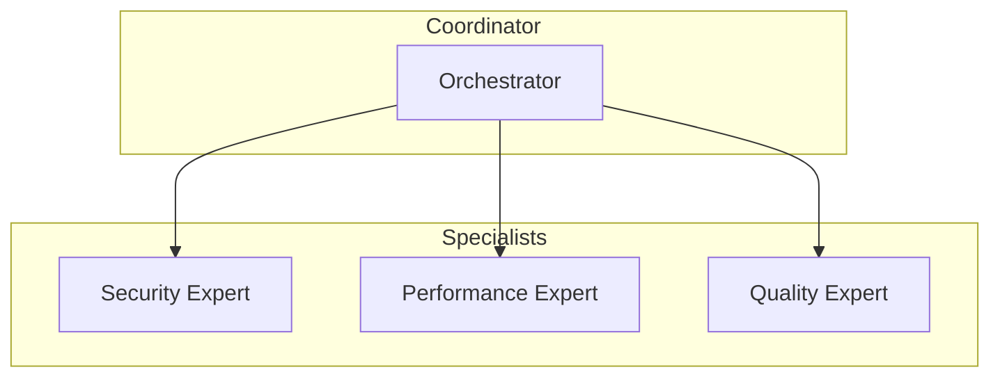

# AI-Driven Development — Knowledge Base

Documentação completa sobre como construir plugins, skills, hooks e agents para AI-driven development em Claude Code.

## Estrutura da Base de Conhecimento

```
docs/
├── README.md                      # Este arquivo - índice
├── ai-driven-dev-ecosystem.md     # Visão do ecossistema (66+ repos GitHub)
├── ai-driven-dev-patterns.md       # Padrões de implementação (Code Review, Test Gen, etc)
├── plugins.md                     # Arquitetura de plugins Claude Code
├── hooks-deep-dive.md             # Sistema de eventos e lifecycle hooks
├── hooks.md                       # Referência rápida de hooks
├── sub-agents.md                  # Subagentes especializados
├── agent-sdk-deep-dive.md         # TypeScript/Python Agent SDK completo
├── agent-sdk.md                   # Referência rápida do SDK
├── skills.md                      # Desenvolvimento de skills/slash commands
├── mcp-deep-dive.md               # Model Context Protocol - especificação completa
└── security-best-practices.md     # Segurança MCP, autenticação, SSRF prevention
```

## Quick Start

### 1. Entenda a Stack

```
┌─────────────────────────────────────────────────────────────┐
│              AI-Driven Development Stack                      │
├─────────────────────────────────────────────────────────────┤
│                                                             │
│   Claude Code Plugins → Skills → Hooks → Subagents          │
│                                                             │
│   Agent SDK (TypeScript/Python)                             │
│                                                             │
│   MCP (Model Context Protocol)                              │
│   ├── Tools     │ Resources  │ Prompts │ Sampling          │
│                                                             │
│   LLM Providers (Claude / GPT / Gemini)                     │
└─────────────────────────────────────────────────────────────┘
```

### 2. Comece pelo Agent SDK

`agent-sdk-deep-dive.md` contém:
- quickstart completo
- todas as opções de ClaudeAgentOptions
- sistema de hooks
- subagents
- MCP integration
- sessions
- permissions
- examples TypeScript e Python

### 3. Aprenda MCP

`mcp-deep-dive.md` contém:
- arquitetura completa client-server
- primitives (Tools, Resources, Prompts)
- security (Confused Deputy, SSRF, Session Hijacking)
- progressive discovery
- programmatic tool calling
- SDKs oficiais

### 4. Implemente Padrões

`ai-driven-dev-patterns.md` contém:
- Automated Code Review
- Test Generation
- Documentation Sync
- Context Injection
- Quality Gates
- Workflow Automation
- Intent Inference
- Multi-Agent Orchestration

## Conceitos Centrais

### O que é AI-Driven Development?

É usar AI agents para automatizar, melhorar e acelerar tarefas de desenvolvimento:
- **Automated Code Generation** — tests, docs, boilerplate
- **Continuous Quality** — auto-review, lint, format
- **Context-Aware Assistance** — projeto contexto injetado automaticamente
- **Workflow Automation** — CI/CD, deployment
- **Knowledge Management** — RAG from codebase

### MCP vs Agent SDK

| Aspecto | MCP | Agent SDK |
|---------|-----|-----------|
| **Purpose** | Protocolo para conectar AI a ferramentas | SDK para construir agentes autônomos |
| **Scope** | External tools/data integration | Full agent loop with Claude |
| **Use Case** | Browser, database, APIs | Bug fixing, code review, task automation |
| **Controls** | Server defines tools | You define agent behavior |

### Quando usar o quê?

```
Preciso de ferramenta externa (browser, DB)?
  → MCP server + .mcp.json

Preciso de agente autônomo?
  → Agent SDK

Preciso reagir a eventos (commit, edit)?
  → Hooks

Preciso de slash command customizado?
  → Skills
```

## Tópicos Avançados

### Segurança (CRÍTICO)

O `security-best-practices.md` cobre:

1. **Confused Deputy Problem** — como proxys MCP podem ser explorados
2. **SSRF Prevention** — bloquear IPs internos, cloud metadata
3. **Token Passthrough** — PROIBIDO, sempre validar tokens
4. **Session Hijacking** — session IDs seguros, binding
5. **Scope Minimization** — tokens com privilégios mínimos

### Performance

1. **Progressive Discovery** — não carregue todas as tools de uma vez
2. **Code Mode** — modelo escreve código que chama tools
3. **Context Caching** — memorize tool definitions
4. **Session Reuse** — mantém contexto entre requests

### Arquitetura de Agentes



## Recursos Externos

- [MCP Spec](https://modelcontextprotocol.io/specification/latest)
- [MCP TypeScript SDK](https://ts.sdk.modelcontextprotocol.io)
- [MCP Python SDK](https://py.sdk.modelcontextprotocol.io)
- [Agent SDK Docs](https://code.claude.com/docs/en/agent-sdk)
- [Anthropic Cookbooks](https://github.com/anthropics/anthropic-cookbook)
- [MCP Servers](https://github.com/modelcontextprotocol/servers)

## Ecossistema GitHub

66+ repositories focados em AI-driven development:

| Projeto | Stars | Linguagem | Focus |
|---------|-------|-----------|-------|
| vulcana | 46 | Python | CLI apps |
| learnflow-ai | 34 | Python | Educational content |
| sruja | 16 | Python | Context engineering |
| CodeCompass | 11 | TypeScript | MCP + Git |
| rn-launch-harness | 6 | TypeScript | React Native lifecycle |
| synapse | 5 | Python | Autonomous agent |

## Próximos Passos

1. Ler `agent-sdk-deep-dive.md` para entender como construir agentes
2. Ler `mcp-deep-dive.md` para integrar ferramentas externas
3. Ler `ai-driven-dev-patterns.md` para padrões de implementação
4. Implementar primeiro hook (ex: `hooks-deep-dive.md` examples)
5. Criar primeiro agent especializado (ex: code-reviewer)

## Contribuindo

Para adicionar conteúdo:
1. Draft no diretório docs/
2. Atualizar este README com novo arquivo
3. Adicionar à seção "Tópicos Avançados" se aplicável
