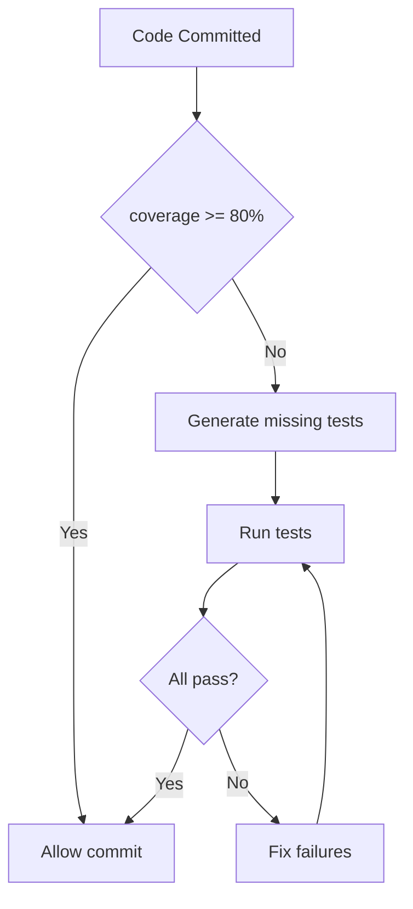
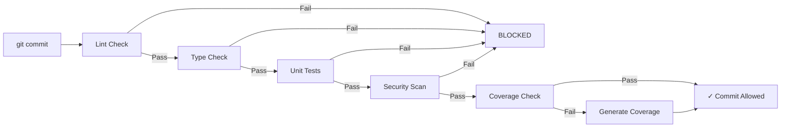
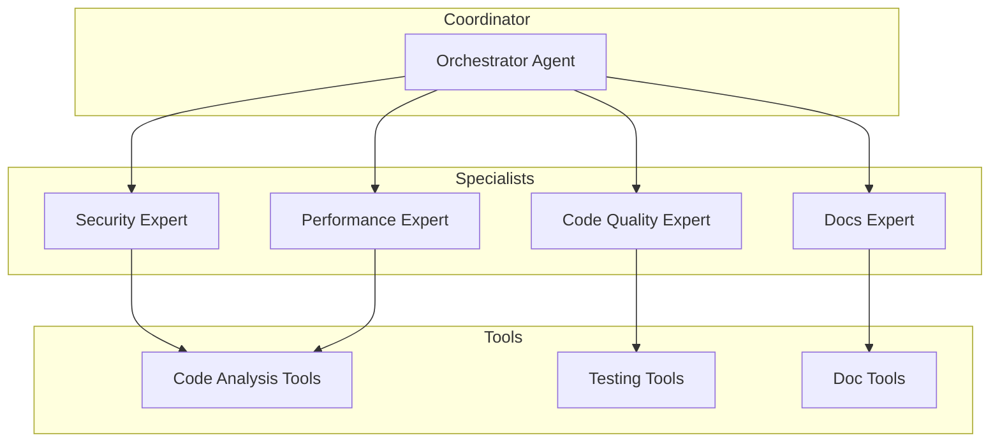

# AI-Driven Development — Patterns & Best Practices

## O que é AI-Driven Development?

AI-Driven Development usa AI agents para automatizar, melhorar e acelerar tarefas de desenvolvimento de software. Não é sobre substituir desenvolvedores, mas sim amplificar sua produtividade.

**6 Pilares:**

1. **Automated Code Generation** — Tests, docs, boilerplate, migrations
2. **Continuous Quality** — Auto-review, lint, format em cada mudança
3. **Context-Aware Assistance** — Injeta contexto do projeto automaticamente
4. **Workflow Automation** — CI/CD, deployment, monitoring
5. **Knowledge Management** — RAG-style context from codebase
6. **Intent Inference** — AI infere intent do desenvolvedor

## Ecossistema

### Top GitHub Repositories

| Repo | Stars | Language | Focus |
|------|-------|----------|-------|
| vulcana | 46 | Python | CLI app framework |
| learnflow-ai | 34 | Python | Educational content generation |
| sruja | 16 | Python | Context engineering + architecture |
| CodeCompass | 11 | TypeScript | MCP + Git + AI coding |
| rn-launch-harness | 6 | TypeScript | React Native full lifecycle |
| synapse | 5 | Python | Autonomous adaptive agent |

### Technology Stack

```
┌─────────────────────────────────────────────────────────────┐
│              AI-Driven Development Stack                      │
├─────────────────────────────────────────────────────────────┤
│                                                             │
│   ┌─────────────────────────────────────────────────────┐  │
│   │     Claude Code Plugins / Skills / Hooks             │  │
│   └─────────────────────────────────────────────────────┘  │
│                              │                              │
│   ┌──────────────────────────▼──────────────────────────┐  │
│   │              Agent SDK (TypeScript/Python)           │  │
│   └─────────────────────────────────────────────────────┘  │
│                              │                              │
│   ┌──────────────────────────▼──────────────────────────┐  │
│   │         MCP (Model Context Protocol)                 │  │
│   │    Tools │ Resources │ Prompts │ Sampling            │  │
│   └─────────────────────────────────────────────────────┘  │
│                              │                              │
│   ┌──────────────────────────▼──────────────────────────┐  │
│   │           LLM Providers (Claude/GPT/Gemini)          │  │
│   └─────────────────────────────────────────────────────┘  │
└─────────────────────────────────────────────────────────────┘
```

## Pattern 1: Automated Code Review

### Arquitetura

```
Code Change → PreCommit Hook → Review Agent → Findings → Report
```

### Implementação

```typescript
// hooks/review-hook.ts
const reviewHook: HookCallback = async (input) => {
  const { files } = input;
  const findings = await spawn("code-reviewer", {
    files,
    rules: await loadProjectRules()
  });

  if (findings.critical > 0) {
    return {
      blocked: true,
      reason: `Critical issues found: ${findings.critical}`,
      report: findings.format()
    };
  }
  return {};
};

// Plugin config
{
  event: "PreCommit",
  matcher: "*",
  handler: reviewHook
}
```

### Multi-Dimension Review

```typescript
const reviewPipeline = {
  name: "comprehensive-review",
  agents: {
    "security-reviewer": {
      focus: ["injection", "auth bypass", "secrets"],
      tools: ["Read", "Grep"]
    },
    "perf-reviewer": {
      focus: ["n+1", "memory leaks", "algorithmic complexity"],
      tools: ["Read", "Bash"]
    },
    "style-reviewer": {
      focus: ["conventions", "naming", "documentation"],
      tools: ["Read", "Glob"]
    }
  },
  orchestrator: async (diff) => {
    const results = await Promise.all([
      spawn("security-reviewer", { diff }),
      spawn("perf-reviewer", { diff }),
      spawn("style-reviewer", { diff })
    ]);
    return consolidateFindings(results);
  }
};
```

## Pattern 2: Test Generation

### Trigger-based Generation

```typescript
// Hook que detecta new/modified code
const testGenerationHook: HookCallback = async (input) => {
  if (input.tool_name === "Write" || input.tool_name === "Edit") {
    const file = input.tool_input?.file_path;
    const code = await readFile(file);

    // Skip if test already exists
    const testFile = findTestFile(file);
    if (testFile) return {};

    // Generate tests
    const tests = await spawn("test-generator", {
      code,
      framework: detectTestFramework(file),
      coverage: "80%"
    });

    await writeFile(testFile, tests);
  }
  return {};
};
```

### Test Coverage Guard



### Snapshot Testing Pipeline

```typescript
const snapshotPipeline = {
  name: "ui-snapshot-tests",
  trigger: "PostToolUse:Write",
  matcher: "**/*.component.tsx",
  steps: [
    {
      name: "detect-changes",
      action: async (file) => {
        const previous = await git.show(`HEAD:${file}`);
        const current = await readFile(file);
        return diff(previous, current);
      }
    },
    {
      name: "update-snapshots",
      condition: (changes) => changes.size > 0,
      action: async (file) => {
        await bash(`npm test -- --updateSnapshot ${file}`);
      }
    }
  ]
};
```

## Pattern 3: Documentation Sync

### Auto-Doc Generation

```typescript
const docsSyncHook: HookCallback = async (input) => {
  const { tool_name, tool_input } = input;

  if (tool_name === "Write" || tool_name === "Edit") {
    const file = tool_input?.file_path;

    // Parse code for documentation extraction
    const parsed = parseCode(file);

    if (parsed.exports.length > 0) {
      // Update API docs
      await spawn("docs-generator", {
        file,
        exports: parsed.exports,
        template: "api-reference"
      });
    }

    if (parsed.hasPublicAPI) {
      // Update README changelog
      await updateChangelog({
        file,
        changes: parsed.changes,
        version: readPackageVersion()
      });
    }
  }
  return {};
};
```

### README Sync

```markdown
<!-- AUTO-GENERATED SECTION - DO NOT EDIT -->
## API Reference

Last updated: 2024-01-15

| Function | Description | Parameters |
|----------|-------------|------------|
| `processData()` | Processes input data | `input: Data[]` |
| `validate()` | Validates schema | `schema: Schema` |

<!-- END AUTO-GENERATED -->
```

## Pattern 4: Context Injection

### Session Start Context

```typescript
const sessionStartHook: HookCallback = async (input) => {
  const { session_id, working_directory } = input;

  // Detect project type
  const projectType = await detectProjectType(working_directory);

  // Load relevant context
  const context = {
    project: {
      type: projectType,
      language: detectLanguage(working_directory),
      framework: detectFramework(working_directory)
    },
    recent: {
      commits: await git.recentCommits(5),
      files: await git.recentlyModified(10),
      issues: await github.getOpenIssues(5)
    },
    patterns: await loadProjectPatterns(working_directory),
    rules: await loadProjectRules(working_directory)
  };

  return {
    injection: {
      type: "system",
      content: formatContext(context)
    }
  };
};
```

### Dynamic Context based on Task

```typescript
const contextRouter = {
  routes: {
    "bug-fix": {
      context: ["error-logs", "test-history", "related-commits"],
      prompt_template: "Focus on: {error_description}"
    },
    "feature": {
      context: ["requirements", "existing-patterns", "test-coverage"],
      prompt_template: "Implement: {feature_description}"
    },
    "refactor": {
      context: ["current-implementation", "tests", "performance-metrics"],
      prompt_template: "Refactor: {target} for {reason}"
    },
    "review": {
      context: ["code-changes", "pr-description", "security-rules"],
      prompt_template: "Review: {files} for {focus_areas}"
    }
  },

  select: (task) => {
    // ML-based or rule-based selection
    return contextRouter.routes[task.type] || contextRouter.routes.default;
  }
};
```

## Pattern 5: Quality Gates

### Pre-Commit Quality Pipeline



### Implementation

```typescript
const qualityGates = {
  gates: [
    {
      name: "lint",
      command: "npm run lint",
      timeout: 60000,
      blocker: true
    },
    {
      name: "typecheck",
      command: "npm run typecheck",
      timeout: 120000,
      blocker: true
    },
    {
      name: "test",
      command: "npm test -- --coverage",
      timeout: 300000,
      blocker: true,
      threshold: { coverage: 80 }
    },
    {
      name: "security",
      command: "npm audit --audit-level=high",
      timeout: 60000,
      blocker: true
    }
  ],

  run: async () => {
    const results = [];
    for (const gate of qualityGates.gates) {
      const result = await runGate(gate);
      results.push(result);
      if (!result.passed && gate.blocker) {
        return { blocked: true, results };
      }
    }
    return { blocked: false, results };
  }
};
```

## Pattern 6: Workflow Automation

### CI/CD Integration

```yaml
# .claude/pipelines/deploy.yaml
name: ai-assisted-deploy
trigger:
  - push to main
  - pull_request merged

steps:
  - name: context-injection
    hook: SessionStart
    action: inject-deploy-context

  - name: quality-gates
    parallel:
      - gate: lint
      - gate: test
      - gate: security-scan

  - name: ai-review
    agent: deploy-reviewer
    focus: ["breaking-changes", "rollback-plan"]

  - name: deploy
    condition: all-gates-passed
    action: execute-deployment
```

### Automated Release Notes

```typescript
const releaseNotesGenerator = {
  name: "auto-release-notes",
  trigger: "PostCommit:tag",

  generate: async (tag) => {
    const commits = await git.commitsBetween(lastTag, tag);
    const prs = await github.getMergedPRsSince(lastTag);

    const notes = {
      highlights: ai.summarize(commits),
      changes: categorize(commits),
      breaking: findBreakingChanges(commits),
      contributors: extractContributors(commits),
      thanks: generateThanks(contributors)
    };

    await writeFile("RELEASE_NOTES.md", format(notes));
  }
};
```

## Pattern 7: Intent Inference

### Prompt Engineering for Intent

```typescript
const intentClassifier = {
  // Few-shot examples
  examples: [
    {
      input: "fix the login bug",
      intent: { type: "bug-fix", priority: "high", area: "auth" }
    },
    {
      input: "add dark mode",
      intent: { type: "feature", priority: "medium", area: "ui" }
    },
    {
      input: "make tests faster",
      intent: { type: "optimization", priority: "low", area: "testing" }
    }
  ],

  classify: async (userInput) => {
    const result = await claude.complete({
      prompt: `
Classify this developer request:
"${userInput}"

Examples:
${intentClassifier.examples.map(e => `"${e.input}" → ${e.intent.type}`).join('\n')}

Respond with JSON: { type, priority, area }
      `,
      schema: intentSchema
    });
    return JSON.parse(result);
  }
};
```

### Dynamic Tool Selection

```typescript
const intentToTools = {
  "bug-fix": ["Read", "Grep", "Bash", "Edit", "Write"],
  "feature": ["Read", "Glob", "Write", "Edit", "Bash"],
  "refactor": ["Read", "Glob", "Grep", "Edit"],
  "optimization": ["Read", "Bash", "Grep"],
  "review": ["Read", "Glob", "Grep"],
  "docs": ["Read", "Write", "Glob"]
};

const selectTools = (intent) => {
  return intentToTools[intent.type] || ["Read", "Glob"];
};
```

## Pattern 8: Multi-Agent Orchestration

### Agent Team Architecture



### Implementation

```typescript
class AgentTeam {
  private agents: Map<string, Agent>;
  private coordinator: Agent;

  async review(pr: PullRequest) {
    // Phase 1: Parallel expert reviews
    const expertReviews = await Promise.all([
      this.spawn("security", { pr, focus: "vulnerabilities" }),
      this.spawn("performance", { pr, focus: "bottlenecks" }),
      this.spawn("quality", { pr, focus: "patterns" }),
      this.spawn("docs", { pr, focus: "completeness" })
    ]);

    // Phase 2: Coordinator synthesizes
    const synthesis = await this.coordinator.synthesize({
      reviews: expertReviews,
      pr
    });

    // Phase 3: Generate actionable feedback
    return this.formatFeedback(synthesis);
  }

  private spawn(agent: string, context: any) {
    return this.agents.get(agent).review(context);
  }
}
```

## Best Practices

### 1. Context Management

```typescript
// Good: Minimal, relevant context
const context = {
  relevant: await loadRelevantFiles(currentTask),
  rules: projectRules.filter(r => r.appliesTo(currentTask)),
  history: recentChanges.filter(c => c.affects(currentTask))
};

// Bad: Everything
const context = await loadEntireRepo(); // Overload!
```

### 2. Tool Selection

```typescript
// Good: Task-specific tools
const tools = {
  "read-code": ["Read", "Glob"],
  "write-tests": ["Read", "Write"],
  "security-audit": ["Read", "Grep", "Bash"]
};

// Bad: All tools always
const tools = ["Read", "Write", "Edit", "Bash", "Glob", "Grep", "WebSearch"];
```

### 3. Error Handling

```typescript
try {
  const result = await agent.execute(task);
} catch (error) {
  if (error.type === "AUTH_ERROR") {
    // Retry with fresh credentials
    await refreshAuth();
    return agent.execute(task);
  }
  if (error.type === "RATE_LIMIT") {
    // Backoff and retry
    await sleep(error.retryAfter);
    return agent.execute(task);
  }
  throw error;
}
```

### 4. Cost Optimization

```typescript
// Use Haiku for simple tasks
const simpleTask = await haiku.complete("What does this function do?");

// Use Opus for complex reasoning
const complexAnalysis = await opus.complete({
  prompt: analyzeSecurityVulnerabilities,
  model: "opus"
});

// Cache frequent lookups
const cachedContext = await cache.getOrCompute(
  `context:${projectId}`,
  () => loadProjectContext(),
  { ttl: 300 } // 5 min
);
```

### 5. Security

```typescript
// Good: Validate all inputs
const validatedInput = schema.validate(input);
if (!validatedInput.valid) {
  throw new Error("Invalid input");
}

// Good: Sandboxed execution
const sandboxedAgent = createAgent({
  tools: allowedTools,
  networkAccess: false,
  fileAccess: { read: [projectDir], write: [testDir] }
});

// Bad: Unlimited access
const agent = createAgent({ tools: ["*"] });
```

## Anti-Patterns

❌ ** NÃO FAÇA:**

```typescript
// Over-automation: AI making decisions without human oversight
const autoCommit = {
  trigger: "PreCommit",
  action: "auto-approve-if-tests-pass"
}; // Humans MUST review before commit

// Context overload: Everything and the kitchen sink
const context = await loadEntireRepo(); // 100k+ tokens

// Tool spam: Calling every tool for every task
if (task.type === "read") {
  await read();
  await glob();    // Why?
  await grep();    // Why?
  await bash();    // Why?
}

// Trust without verification
const result = await ai.execute(code);
run(result); // NEVER run untrusted code directly
```

✅ ** FAÇA:**

```typescript
// Human in the loop for important decisions
const reviewRequired = {
  trigger: "PreDeploy",
  condition: (changes) => changes.breaking,
  action: "request-human-approval"
};

// Minimal, focused context
const context = await loadRelevantContext(task, { limit: 2000 });

// Specific tool selection
const tools = selectToolsFor(task);

// Verify before execute
const verified = await verifySecurity(result);
if (verified.safe) {
  run(result);
} else {
  alert("Security issue detected!");
}
```

## Metrics & Monitoring

```typescript
const metrics = {
  // Track AI usage
  tokensUsed: [],
  costPerTask: [],
  latencyPerTask: [],

  // Track outcomes
  tasksAutomated: [],
  tasksBlocked: [],
  humanInterventions: [],

  // Quality metrics
  bugsCaught: [],
  falsePositives: [],
  coverageImprovement: []
};

// Collect metrics
const trackMetrics = async (task, result) => {
  metrics.tokensUsed.push(result.tokens);
  metrics.costPerTask.push(result.cost);
  metrics.tasksAutomated.push(task.id);

  if (result.blocked) {
    metrics.tasksBlocked.push(task.id);
  }
  if (result.humanIntervention) {
    metrics.humanInterventions.push(task.id);
  }
};
```

## Implementation Checklist

- [ ] Hook infrastructure configured
- [ ] Error handling in place
- [ ] Logging configured
- [ ] Metrics collection setup
- [ ] Security scanning integrated
- [ ] Test generation pipeline
- [ ] Documentation sync
- [ ] Quality gates defined
- [ ] Human approval workflows
- [ ] Rollback procedures

## Referências

- [Anthropic Claude Cookbooks](https://github.com/anthropics/anthropic-cookbook)
- [MCP Ecosystem](https://github.com/modelcontextprotocol/servers)
- [Agent SDK](https://code.claude.com/docs/en/agent-sdk)
- [sruja - Context Engineering](https://github.com/sruja-ai/sruja)
