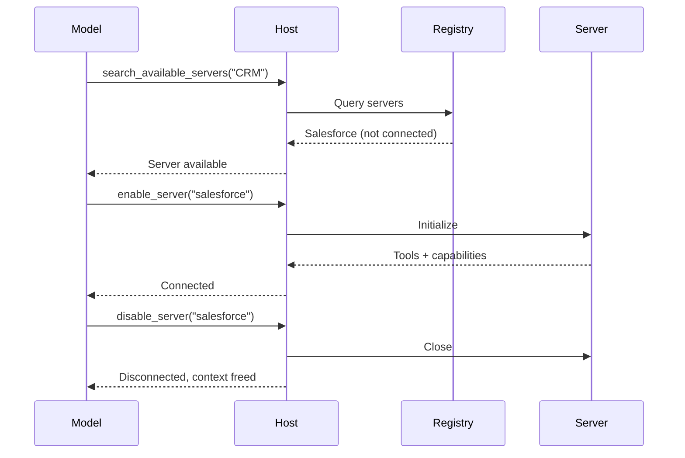
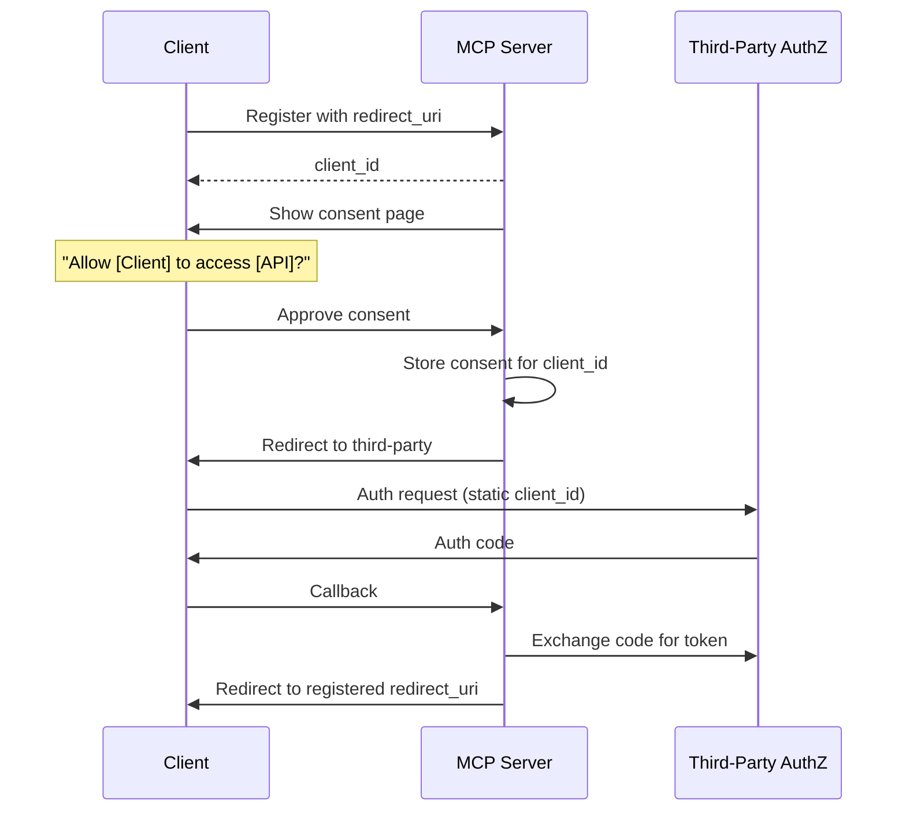

# MCP — Model Context Protocol (Deep Dive)

## O que é MCP?

MCP (Model Context Protocol) é um protocolo aberto para conectar aplicações AI a sistemas externos. Pense nele como USB-C para AI — um padrão universal que permite a qualquer cliente AI conectar-se a ferramentas, dados e workflows.

```
┌─────────────────────────────────────────────────────────────────┐
│                        MCP Host (AI Application)                  │
│   Claude Code │ Claude Desktop │ VS Code │ Cursor │ ChatGPT     │
├─────────────────────────────────────────────────────────────────┤
│                     MCP Client Layer                             │
│   ┌─────────────┐  ┌─────────────┐  ┌─────────────┐           │
│   │  Client 1   │  │  Client 2   │  │  Client N   │           │
│   └──────┬──────┘  └──────┬──────┘  └──────┬──────┘           │
├──────────┼────────────────┼────────────────┼───────────────────┤
│          │    STDIO       │  Streamable    │                   │
│          │   Transport    │   HTTP         │                   │
├──────────┼────────────────┼────────────────┼───────────────────┤
│   ┌──────▼──────┐  ┌──────▼──────┐  ┌──────▼──────┐           │
│   │  Local      │  │  Remote     │  │  Remote     │           │
│   │  Server    │  │  Server A   │  │  Server B   │           │
│   │  (Files)   │  │  (Sentry)   │  │  (DB)       │           │
│   └─────────────┘  └─────────────┘  └─────────────┘           │
└─────────────────────────────────────────────────────────────────┘
```

## Arquitetura em Camadas

### Layer 1: Data Layer (JSON-RPC 2.0)

O protocolo de comunicação cliente-servidor baseado em JSON-RPC 2.0:

**Operações de Lifecycle:**
```json
// Inicialização
{
  "jsonrpc": "2.0",
  "id": 1,
  "method": "initialize",
  "params": {
    "protocolVersion": "2025-06-18",
    "capabilities": { "tools": {}, "resources": {} },
    "clientInfo": { "name": "my-app", "version": "1.0.0" }
  }
}

// Resposta
{
  "jsonrpc": "2.0",
  "id": 1,
  "result": {
    "protocolVersion": "2025-06-18",
    "capabilities": { "tools": { "listChanged": true } },
    "serverInfo": { "name": "weather-server", "version": "1.0.0" }
  }
}
```

**Capability Negotiation:** O handshake inicial negocia quais features cada lado suporta (tools, resources, prompts, elicitation, sampling).

### Layer 2: Transport Layer

**STDIO Transport:** Para comunicação local (mesma máquina). Otimizado para latency zero.

**Streamable HTTP Transport:** Para servidores remotos. Suporta:
- HTTP POST para mensagens cliente→servidor
- Server-Sent Events (SSE) para streaming servidor→cliente
- OAuth 2.0 + Bearer tokens para autenticação

## Primitives (Conceitos Centrais)

MCP define 3 primitivas que **servidores** podem expor:

### 1. Tools (Funções executáveis pelo LLM)

```typescript
// Definição de tool
{
  name: "searchFlights",
  description: "Search for available flights",
  inputSchema: {
    type: "object",
    properties: {
      origin: { type: "string", description: "Departure city" },
      destination: { type: "string", description: "Arrival city" },
      date: { type: "string", format: "date" }
    },
    required: ["origin", "destination", "date"]
  },
  outputSchema: {  // Opcional mas RECOMENDADO
    type: "object",
    properties: {
      flights: { type: "array", items: { "$ref": "#/Flight" } }
    }
  }
}

// Execução
{
  "method": "tools/call",
  "params": {
    "name": "searchFlights",
    "arguments": { "origin": "NYC", "destination": "LAX", "date": "2024-06-15" }
  }
}
```

**Protocol Operations:**
| Method | Purpose | Returns |
|--------|---------|---------|
| `tools/list` | Discover available tools | Array of tool definitions |
| `tools/call` | Execute a specific tool | Tool execution result |

### 2. Resources (Dados read-only para contexto)

```typescript
// Resource direto
{
  uri: "file:///docs/readme.md",
  name: "readme",
  mimeType: "text/markdown",
  description: "Project README"
}

// Resource template (dinâmico)
{
  uriTemplate: "weather://forecast/{city}/{date}",
  name: "weather-forecast",
  mimeType: "application/json",
  description: "Get weather for any city and date"
}
```

**Protocol Operations:**
| Method | Purpose | Returns |
|--------|---------|---------|
| `resources/list` | List direct resources | Array of resource descriptors |
| `resources/templates/list` | Discover resource templates | Array of template definitions |
| `resources/read` | Retrieve resource contents | Resource data with metadata |
| `resources/subscribe` | Monitor changes | Subscription confirmation |

### 3. Prompts (Templates reutilizáveis)

```json
{
  "name": "plan-vacation",
  "title": "Plan a vacation",
  "description": "Guide through vacation planning process",
  "arguments": [
    { "name": "destination", "type": "string", "required": true },
    { "name": "duration", "type": "number", "description": "days" },
    { "name": "budget", "type": "number" },
    { "name": "interests", "type": "array", "items": { "type": "string" } }
  ]
}
```

**Protocol Operations:**
| Method | Purpose | Returns |
|--------|---------|---------|
| `prompts/list` | Discover available prompts | Array of prompt descriptors |
| `prompts/get` | Retrieve prompt details | Full prompt with arguments |

## Client Primitives

MCP também define primitivas que **clientes** podem expor:

### Sampling

Permite que servidores solicitem completion do LLM do cliente:

```json
{
  "method": "sampling/createMessage",
  "params": {
    "systemPrompt": "You are a travel assistant.",
    "messages": [...],
    "maxTokens": 1024
  }
}
```

### Elicitation

Permite que servidores solicitem input do usuário:

```json
{
  "method": "elicitation/create",
  "params": {
    "message": "Which flight do you prefer?",
    "options": [
      { "label": "Direct (2h)", "description": "Nonstop" },
      { "label": "Cheapest (5h)", "description": "1 connection" }
    ]
  }
}
```

## Padrões Avançados

### 1. Progressive Discovery (Para hosts com muitas tools)

**Problema:** Carregar todas as tool definitions consome contexto demais.

**Solução:**three-layer pattern:

```typescript
// Layer 1: Catalog — busca leve
search_tools({ query: "update salesforce record" })
// → [{ name: "salesforce_updateRecord", description: "Update fields..." }]

// Layer 2: Inspect — carrega só o necessário
get_tool_details({ name: "salesforce_updateRecord" })
// → { full schema, inputSchema, outputSchema }

// Layer 3: Execute — executa com contexto completo
salesforce_updateRecord({ objectType: "Contact", recordId: "123", data: {...} })
```

### 2. Programmatic Tool Calling (Code Mode)

O modelo escreve código que chama tools, ao invés de chamar tools diretamente:

```typescript
// Modelo gera script (executa em sandbox)
const logs = await logging_getLogs({ level: "error", since: Date.now() - 3600000 });
const uniqueErrors = new Map();
for (const log of logs.entries) {
  if (!uniqueErrors.has(log.message)) {
    uniqueErrors.set(log.message, log);
  }
}
for (const [message, log] of uniqueErrors) {
  await ticketing_createIssue({ title: `Error: ${message}`, priority: "high" });
}
console.log(`Filed ${uniqueErrors.size} tickets`);
```

**Benefício:** Resultados intermediários NÃO passam pelo contexto do LLM. Só o `console.log` final volta.

### 3. Dynamic Server Management



## Security (CRÍTICO)

### Ataques e Mitigações

#### 1. Confused Deputy Problem

**Ataque:** Proxy MCP malicioso consegue authorization codes sem consentimento.

**Mitigação:**
- Per-client consent storage (não apenas "user consentiu uma vez")
- Validar `redirect_uri` exatamente
- OAuth `state` parameter com cryptographically secure random
- CSRF protection



#### 2. Server-Side Request Forgery (SSRF)

**Ataque:** Servidor MCP malicioso induz cliente a fazer requests para IPs internos.

**Mitigação:**
- Rejeitar `http://` exceto para loopback (`localhost`, `127.0.0.1`)
- Bloquear IP ranges privados: `10.0.0.0/8`, `172.16.0.0/12`, `192.168.0.0/16`
- Bloquear link-local: `169.254.0.0/16` (inclui cloud metadata `169.254.169.254`)
- Validar redirect targets

#### 3. Token Passthrough (PROIBIDO)

**Problema:** Servidor aceita tokens do cliente e passa direto para downstream API.

**Riscos:**
- Bypasses security controls (rate limiting, validation)
- Audit trail quebrado
- Credential exfiltration

**Mitigação:** Servidores DEVEM validar que tokens foram emitidos PARA eles, não para o cliente.

#### 4. Session Hijacking

**Ataque:** Atacker obtém session ID e se faz passar pelo cliente.

**Mitigação:**
- Session IDs non-deterministic (UUIDs com secure random)
- Bind session a user-specific info (`<user_id>:<session_id>`)
- Re-authenticate para operações sensíveis

### Scope Minimization

**Problema:** Tokens com scopes amplos ( `files:*`, `db:*`, `admin:*` ) aumentam impacto de roubo.

**Solução:**
- Minimal initial scope (`mcp:tools-basic` — só discovery/read)
- Progressive elevation via `WWW-Authenticate` challenges
- Server deve aceitar reduced scope tokens

## Multi-Agent Pattern

```
┌──────────────────────────────────────────────────────────────────┐
│                    AI Travel Planner Application                  │
├──────────────────────────────────────────────────────────────────┤
│  ┌─────────────┐  ┌─────────────┐  ┌─────────────┐             │
│  │   Travel    │  │   Weather   │  │  Calendar/  │             │
│  │   Server    │  │   Server    │  │   Email     │             │
│  │ flights,    │  │  forecast,  │  │  schedule,  │             │
│  │ hotels      │  │  climate    │  │  notify     │             │
│  └──────┬──────┘  └──────┬──────┘  └──────┬──────┘             │
├─────────┼───────────────┼─────────────────┼──────────────────────┤
│         │               │                 │                      │
│    ┌────▼────┐     ┌────▼────┐       ┌────▼────┐              │
│    │ search  │     │  get    │       │ create  │              │
│    │ flights │     │ weather │       │ calendar │              │
│    │    │    │     │    │    │       │   event │              │
│    └────│────┘     └────│────┘       └────│────┘              │
│         │               │                 │                    │
│         └───────────────┴─────────────────┘                    │
│                         │                                      │
│                  ┌──────▼──────┐                              │
│                  │   Tools     │                              │
│                  │  (Model    │                              │
│                  │  calls)     │                              │
│                  └─────────────┘                              │
└───────────────────────────────────────────────────────────────┘
```

**Fluxo completo:**
1. User seleciona prompt "plan-vacation" com parameters
2. User seleciona resources: calendar, travel preferences, past trips
3. AI processa usando tools em múltiplos servidores
4. AI executa booking com approval do usuário onde necessário

## SDKs Oficiais

| SDK | Repository | Tier | Status |
|-----|------------|------|--------|
| TypeScript | `modelcontextprotocol/typescript-sdk` | 1 (Tier 1) | Production |
| Python | `modelcontextprotocol/python-sdk` | 1 (Tier 1) | Production |
| C# | `modelcontextprotocol/csharp-sdk` | 1 (Tier 1) | Production |
| Go | `modelcontextprotocol/go-sdk` | 1 (Tier 1) | Production |
| Java | `modelcontextprotocol/java-sdk` | 2 (Tier 2) | Beta |
| Rust | `modelcontextprotocol/rust-sdk` | 2 (Tier 2) | Beta |
| Swift | `modelcontextprotocol/swift-sdk` | 3 (Tier 3) | Experimental |
| Ruby | `modelcontextprotocol/ruby-sdk` | 3 (Tier 3) | Experimental |
| PHP | `modelcontextprotocol/php-sdk` | 3 (Tier 3) | Experimental |

## Para AI-Driven Development

### MCP como backbone de automação

```
┌─────────────────────────────────────────────────────────────────┐
│                   AI-Driven Development Stack                    │
├─────────────────────────────────────────────────────────────────┤
│                                                                 │
│  ┌───────────────┐  ┌───────────────┐  ┌───────────────┐       │
│  │  Code Review  │  │ Test Gen     │  │  Docs Sync   │       │
│  │  Agent       │  │ Agent        │  │  Hook        │       │
│  └───────┬───────┘  └───────┬───────┘  └───────┬───────┘       │
│          │                  │                  │               │
│    ┌─────▼─────┐      ┌─────▼─────┐      ┌─────▼─────┐       │
│    │  GitHub   │      │  Jest/    │      │  Markdown │       │
│    │  MCP      │      │  Pytest   │      │  Parser   │       │
│    │  Server   │      │  MCP      │      │  MCP      │       │
│    └───────────┘      └───────────┘      └───────────┘       │
│                                                                 │
│  ┌─────────────────────────────────────────────────────────┐   │
│  │              MCP Host (Claude Code / Agent SDK)          │   │
│  └─────────────────────────────────────────────────────────┘   │
└─────────────────────────────────────────────────────────────────┘
```

### Servidores MCP úteis para AI-Driven Dev

| Servidor | Capabalities | Uso |
|----------|--------------|-----|
| `mcp/servers/filesystem` | Read/Write files | Acesso a código |
| `mcp/servers/git` | Git operations | Version control |
| `mcp/servers/github` | Issues, PRs, repos | GitHub integration |
| `mcp/servers/sequential-reasoning` | Chain-of-thought | Debugging complexo |
| `mcp/servers/everything` | Aggregates all tools | Discovery |

## Referências

- [MCP Spec](https://modelcontextprotocol.io/specification/latest)
- [MCP TypeScript SDK](https://ts.sdk.modelcontextprotocol.io)
- [MCP Python SDK](https://py.sdk.modelcontextprotocol.io)
- [Server Examples](https://github.com/modelcontextprotocol/servers)
