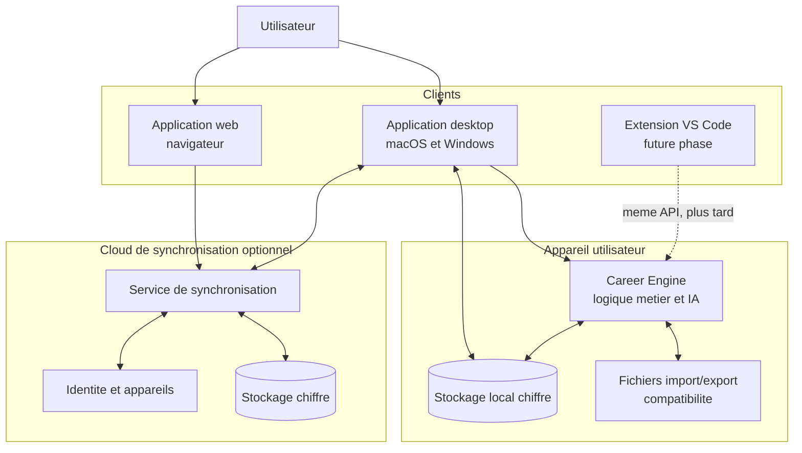

# Architecture cible : Desktop + Web local-first

> **Statut :** Proposition approuvee de direction produit  
> **Date :** 2026-07-18  
> **Portee :** Architecture cible pour le produit desktop macOS/Windows et son application web synchronisee  
> **Hors portee :** Plan d'implementation detaille, extension VS Code et collaboration multi-utilisateur

## Decision

Le produit devient une application de bureau pour utilisateurs non techniques,
disponible sur macOS et Windows, accompagnee d'une application web synchronisee.

Les donnees restent locales par defaut. La synchronisation cloud est explicite,
chiffree et optionnelle. Les futurs clients, y compris une extension VS Code
pour utilisateurs techniques, utilisent le meme moteur et le meme contrat de
donnees.

Le desktop est l'experience complete pour le travail de fond. Le web permet de
consulter, reprendre et effectuer les actions courantes depuis n'importe quel
navigateur. Ce n'est pas un produit independant.

## Pourquoi cette direction

- Les candidats non techniques ne doivent pas configurer des fichiers YAML,
  lancer un terminal ou comprendre les modes d'un agent.
- Un CV, des candidatures, des attentes salariales et des notes d'entretien
  sont des donnees personnelles sensibles : l'utilisateur doit conserver le
  controle de leur stockage et de leur synchronisation.
- Une base locale permet de travailler hors ligne et limite la dependance a un
  service cloud.
- Un moteur commun evite de reconstruire la logique metier pour le desktop, le
  web et la future extension VS Code.

## Principes non negociables

1. **Human-in-the-loop.** Le produit prepare, recommande et pre-remplit ; il
   ne soumet jamais une candidature sans validation humaine.
2. **Local-first.** Une installation desktop reste utilisable hors ligne avec
   les donnees deja disponibles.
3. **Synchronisation explicite.** Aucun compte ni envoi cloud n'est impose lors
   de l'onboarding.
4. **Privacy by default.** Les donnees utilisateur ne servent jamais a
   entrainer un modele sans consentement distinct et explicite.
5. **Contrat partage.** Les clients ne lisent pas directement les fichiers de
   travail comme contrat d'interface ; ils utilisent le Career Engine.
6. **Interoperabilite.** Les fichiers existants restent importables et
   exportables pendant la transition.

## Vue d'ensemble cible

## Responsabilites par couche

| Couche | Responsabilite | Ne doit pas faire |
|---|---|---|
| Application desktop | Onboarding, travail de fond, imports, documents, experience hors ligne | Devenir un simple navigateur du produit web |
| Application web | Acces synchronise, consultation, reprises et actions courantes | Maintenir une logique metier differente du desktop |
| Career Engine | Evaluations, pipeline, generation de documents, regles de statut, validation | Dependre d'une UI ou d'un fournisseur de modele unique |
| Stockage local | Source disponible hors ligne, cache de sync, journal d'evenements | Etre ecrase sans conflit par le cloud |
| Service de sync | Replication, appareils, chiffrement, conflits, statut de sync | Prendre des decisions metier ou modifier silencieusement des donnees |
| Fichiers existants | Import/export et compatibilite CLI avancee | Etre la surface principale pour les utilisateurs non techniques |

## Modele de donnees et synchronisation

### Donnees a synchroniser en premier

| Domaine | Exemples | Priorite |
|---|---|---|
| Identite et preferences | Profil, localisation, roles cibles, langue, consentements | P0 |
| Pipeline | Offres, statut, notes, dates, priorites | P0 |
| Evaluations | Score, risques, recommandations, liens vers artefacts | P0 |
| Documents textuels | CV source, lettres, emails brouillons | P1 |
| Artefacts lourds | PDF, captures, journaux de run | P2 |

Le MVP synchronise les donnees structurees et les metadonnees. Les artefacts
lourds ne bloquent ni l'experience hors ligne ni le premier lancement.

### Journal d'evenements

Chaque modification locale produit un evenement avec :

- un identifiant immutable ;
- l'identifiant du compte et de l'appareil ;
- l'entite modifiee et son numero de version ;
- un horodatage et un type d'operation ;
- le contenu chiffre ou une reference verifiable.

Le service de synchronisation replique les evenements plutot que d'ecraser des
documents complets. Ce choix permet un historique, des reprises et une gestion
des conflits compréhensible.

### Resolution des conflits

| Situation | Regle |
|---|---|
| Deux champs independants sont modifies | Fusion automatique au niveau des champs |
| Deux statuts incompatibles sont modifies | Conflit visible dans le produit ; aucune perte silencieuse |
| Deux edits du meme texte se chevauchent | Conserver les deux versions et demander une resolution |
| Un appareil est hors ligne | File locale, synchronisation a la reconnexion |
| Un conflit ne peut pas etre resolu | Restaurer une version precedente ou conserver un doublon explicite |

Le statut de synchronisation doit etre visible : dernier appareil synchronise,
derniere synchronisation reussie, actions en attente et conflits a resoudre.

## Securite et confidentialite

| Exigence | Decision |
|---|---|
| Consentement | La sync cloud est un choix explicite, reversible depuis les reglages |
| Chiffrement | Chiffrement en transit et au repos ; les cles et le modele de chiffrement sont definis avant la beta |
| Appareils | Liste des appareils connectes, revocation a distance et nouvelle authentification pour un appareil inconnu |
| Suppression | Export utilisateur, suppression du compte et suppression des donnees cloud definis avant lancement |
| Acces IA | Toute execution IA indique les donnees envoyees au fournisseur selectionne |
| Observabilite | Les logs techniques excluent CV, contenu de lettres, notes d'entretien et autres PII |

## Parcours utilisateur cible

1. L'utilisateur installe l'application desktop.
2. Il importe son CV ou le construit via un onboarding guide.
3. Il choisit de rester uniquement local ou d'activer la synchronisation.
4. Il ajoute une offre depuis une URL ou un texte et obtient une evaluation.
5. Il decide de preparer ou non une candidature et genere son dossier.
6. Il consulte ou met a jour son pipeline depuis le web.
7. Le desktop et le web affichent le meme etat, avec un statut de sync clair.

## Evolution de l'architecture actuelle

L'architecture existante est file-first : les fichiers Markdown et YAML sont
canoniques, avec Django et SQLite comme couches derives. Cette direction
produit ne supprime pas cette compatibilite immediatement.

| Etat actuel | Evolution cible |
|---|---|
| Fichiers comme contrat principal | Career Engine et API versionnee comme contrat principal |
| Django local + Next.js local | Engine local dans le desktop, services cloud limites a l'identite et a la sync |
| SQLite derivee | Stockage local transactionnel pour le produit, avec import/export des fichiers |
| Web lie au poste local | Web connecte au compte synchronise de l'utilisateur |
| CLI comme interface majeure | Desktop comme interface principale ; CLI et VS Code comme mode avance |

## Decoupage en phases

### Phase 1 - MVP desktop

- Desktop macOS/Windows ;
- stockage local ;
- onboarding sans terminal ;
- import/export des fichiers existants ;
- pipeline, evaluation et generation de dossier ;
- schema de donnees versionne.

### Phase 2 - Beta privee synchronisee

- comptes et appareils ;
- synchronisation des profils, pipeline, evaluations et brouillons ;
- application web de consultation et reprise ;
- journal et indicateur de synchronisation ;
- gestion des conflits.

### Phase 3 - Lancement controle

- artefacts lourds synchronises ;
- sauvegarde, restauration, export et suppression ;
- monitoring de fiabilite et support ;
- application desktop signee pour macOS et Windows.

### Phase 4 - Mode developpeur

- extension VS Code ;
- commandes CLI ;
- acces aux fichiers et automatisations avancees ;
- meme compte, meme moteur, meme contrat de donnees.

## Decisions explicitement reportees

| Decision | Statut | Condition de reprise |
|---|---|---|
| Collaboration multi-utilisateur | Reportee | Validation de la sync individuelle et des permissions |
| Soumission autonome de candidatures | Refusee pour le MVP | Controle humain et exigences legales clairement definis |
| Marketplace de plugins | Reportee | Boucle desktop stabilisee et demandes recurrentes verifiees |
| Edition collaborative temps reel | Reportee | Besoin prouve par les utilisateurs et architecture de conflits mature |
| Extension VS Code | Reportee | Retention du produit desktop et API stable |

## Criteres d'acceptation de la beta

- Un utilisateur non technique realise son premier cycle complet en moins de
  15 minutes sans utiliser de terminal.
- Un changement effectue sur desktop apparait sur le web apres synchronisation.
- Un changement effectue sur le web reapparait sur le desktop sans perte de
  donnees.
- Un conflit est detectable et resolvable sans modifier manuellement un fichier.
- L'application desktop reste utilisable hors ligne avec ses donnees locales.
- Aucune candidature n'est envoyee automatiquement.

## Consequence pour les prochains choix techniques

Les prochaines specifications doivent partir du contrat du Career Engine et du
modele de synchronisation, avant de choisir un shell desktop ou de multiplier
les ecrans. Une interface desktop et une interface web ne doivent jamais
dupliquer leurs propres regles de pipeline, de statut ou de generation.
