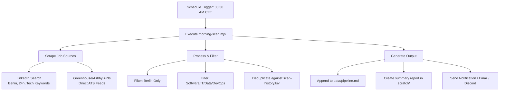

# Automated Morning Job Scanner for Berlin Tech Roles

This guide explains how to build, configure, and automate a morning job scanner that runs daily and compiles a fresh list of **Software/Tech Working Student (Werkstudent)** roles in **Berlin** by **9:00 AM CET**.

---

## 🏗️ System Architecture

The automated job-scanning pipeline operates as follows:



---

## 🛠️ Step 1: Create the Morning Scanner Script

We will create a script `morning-berlin-scan.mjs` in the project root. This script queries **LinkedIn** for jobs posted in the **last 24 hours** using Playwright, parses the listings, applies a software/tech keyword filter, deduplicates them against your existing application history, and outputs them.

```javascript
// morning-berlin-scan.mjs
import { chromium } from 'playwright';
import fs from 'fs';
import path from 'path';
import https from 'https';
import dotenv from 'dotenv';

// Load environment variables
dotenv.config();

// Config
const SEARCH_KEYWORDS = '("werkstudent" OR "working student" OR "intern" OR "internship" OR "praktikant" OR "praktikum") AND ("software" OR "developer" OR "programmer" OR "entwickler" OR "frontend" OR "backend" OR "fullstack" OR "devops" OR "data science" OR "AI" OR "KI" OR "cloud")';
const LOCATION = 'Berlin, Germany';
const OUTPUT_MD = 'scratch/morning-berlin-jobs.md';
const PIPELINE_PATH = 'data/pipeline.md';
const SCAN_HISTORY_PATH = 'data/scan-history.tsv';

const TARGET_COMPANIES = ['BMW', 'Tesla', 'Cariad', 'Delivery Hero', 'Zalando', 'N26'];

// Validate if a job title represents a student tech position
function isStudentTechJob(title) {
  const lowerTitle = title.toLowerCase();
  
  // Student keywords
  const studentKeywords = [
    'werkstudent', 'working student', 'intern', 'praktikant', 'praktikum', 
    'student', 'internship', 'thesis', 'masterarbeit', 'bachelorarbeit'
  ];
  
  // Tech keywords
  const techKeywords = [
    'software', 'developer', 'programmer', 'entwickler', 'frontend', 
    'backend', 'fullstack', 'devops', 'data', 'ai', 'ki', 'cloud', 
    'engineer', 'tech', 'coder', 'computational', 'computer science'
  ];
  
  const hasStudent = studentKeywords.some(kw => lowerTitle.includes(kw));
  const hasTech = techKeywords.some(kw => lowerTitle.includes(kw));
  
  return hasStudent && hasTech;
}

// Send formatted alert to Telegram
async function sendTelegramMessage(text) {
  const token = process.env.TELEGRAM_BOT_TOKEN;
  const chatId = process.env.TELEGRAM_CHAT_ID;
  
  if (!token || !chatId) {
    console.log('Telegram Bot Token or Chat ID not configured. Skipping Telegram notification.');
    return;
  }
  
  const url = `https://api.telegram.org/bot${token}/sendMessage`;
  const data = JSON.stringify({
    chat_id: chatId,
    text: text,
    parse_mode: 'HTML',
    disable_web_page_preview: true
  });
  
  return new Promise((resolve, reject) => {
    const req = https.request(url, {
      method: 'POST',
      headers: {
        'Content-Type': 'application/json',
        'Content-Length': data.length
      }
    }, (res) => {
      let body = '';
      res.on('data', chunk => body += chunk);
      res.on('end', () => {
        if (res.statusCode >= 200 && res.statusCode < 300) {
          console.log('Telegram notification sent successfully.');
          resolve(JSON.parse(body));
        } else {
          console.error(`Telegram API error: ${res.statusCode} ${body}`);
          reject(new Error(`Telegram API returned status ${res.statusCode}`));
        }
      });
    });
    
    req.on('error', (err) => {
      console.error('Failed to send Telegram notification:', err);
      reject(err);
    });
    
    req.write(data);
    req.end();
  });
}

async function loadSeenUrls() {
  const seen = new Set();
  if (fs.existsSync(SCAN_HISTORY_PATH)) {
    const lines = fs.readFileSync(SCAN_HISTORY_PATH, 'utf-8').split('\n');
    for (const line of lines.slice(1)) {
      const url = line.split('\t')[0];
      if (url) seen.add(url);
    }
  }
  if (fs.existsSync(PIPELINE_PATH)) {
    const text = fs.readFileSync(PIPELINE_PATH, 'utf-8');
    for (const match of text.matchAll(/- \[[ x]\] (https?:\/\/\S+)/g)) {
      seen.add(match[1]);
    }
  }
  return seen;
}

async function run() {
  console.log(`[${new Date().toISOString()}] Starting Berlin Tech Job Scan...`);
  const seenUrls = await loadSeenUrls();
  
  // LinkedIn search query URL:
  // f_TPR=r86400 restricts results to the last 24 hours (86,400 seconds)
  const searchUrl = `https://www.linkedin.com/jobs/search/?keywords=${encodeURIComponent(SEARCH_KEYWORDS)}&location=${encodeURIComponent(LOCATION)}&f_TPR=r86400`;
  console.log(`Navigating to: ${searchUrl}`);

  const browser = await chromium.launch({ headless: true });
  const context = await browser.newContext({
    userAgent: 'Mozilla/5.0 (Windows NT 10.0; Win64; x64) AppleWebKit/537.36 (KHTML, like Gecko) Chrome/120.0.0.0 Safari/537.36',
    locale: 'en-US',
  });
  const page = await context.newPage();

  const newJobs = [];

  try {
    await page.goto(searchUrl, { waitUntil: 'networkidle', timeout: 45000 });
    
    // Auto-scroll to load dynamic job cards
    for (let i = 0; i < 5; i++) {
      await page.mouse.wheel(0, 1000);
      await page.waitForTimeout(1000);
    }

    // Extract job cards
    const cards = await page.$$('.jobs-search__results-list li');
    console.log(`Found ${cards.length} potential job cards.`);

    for (const card of cards) {
      try {
        const titleEl = await card.$('.base-search-card__title');
        const companyEl = await card.$('.base-search-card__subtitle');
        const locationEl = await card.$('.job-search-card__location');
        const linkEl = await card.$('.base-card__full-link');

        if (!titleEl || !companyEl || !linkEl) continue;

        const title = (await titleEl.innerText()).trim();
        const company = (await companyEl.innerText()).trim();
        const location = locationEl ? (await locationEl.innerText()).trim() : 'Berlin';
        let url = await linkEl.getAttribute('href');
        
        // Clean URL query parameters to avoid duplicate tracking
        if (url) {
          url = url.split('?')[0];
        }

        if (url && !seenUrls.has(url)) {
          if (isStudentTechJob(title)) {
            newJobs.push({ title, company, location, url, date: new Date().toISOString().slice(0, 10) });
            seenUrls.add(url);
          } else {
            console.log(`Skipping non-student/non-tech role: "${title}" at ${company}`);
          }
        }
      } catch (err) {
        // Skip malformed cards
      }
    }

    console.log(`Extracted ${newJobs.length} new, unique software/tech jobs posted in the last 24h.`);

    if (newJobs.length > 0) {
      // Create output directory if not exists
      const scratchDir = path.dirname(OUTPUT_MD);
      if (!fs.existsSync(scratchDir)) {
        fs.mkdirSync(scratchDir, { recursive: true });
      }

      // 1. Save local markdown report
      let markdown = `# 🌅 Morning Berlin Tech Jobs - ${new Date().toLocaleDateString()}\n\n`;
      markdown += `Generated at: **${new Date().toLocaleTimeString()}**\n`;
      markdown += `Found **${newJobs.length}** new Werkstudent positions in Berlin posted within the last 24h:\n\n`;
      markdown += `| Company | Role | Link |\n`;
      markdown += `| :--- | :--- | :--- |\n`;
      
      newJobs.forEach(job => {
        const isTarget = TARGET_COMPANIES.some(tc => job.company.toLowerCase().includes(tc.toLowerCase()));
        const companyDisplay = isTarget ? `🚨 **${job.company} (TARGET)**` : `**${job.company}**`;
        markdown += `| ${companyDisplay} | ${job.title} | [View Job](${job.url}) |\n`;
      });
      
      fs.writeFileSync(OUTPUT_MD, markdown, 'utf8');
      console.log(`Saved report to ${OUTPUT_MD}`);

      // 2. Append to career-ops pipeline.md under '## Pendientes'
      let pipelineText = fs.readFileSync(PIPELINE_PATH, 'utf-8');
      const marker = '## Pendientes';
      const insertIdx = pipelineText.indexOf(marker);

      if (insertIdx !== -1) {
        const afterMarker = insertIdx + marker.length;
        const newLines = '\n' + newJobs.map(j => `- [ ] ${j.url} | ${j.company} | ${j.title}`).join('\n') + '\n';
        pipelineText = pipelineText.slice(0, afterMarker) + newLines + pipelineText.slice(afterMarker);
        fs.writeFileSync(PIPELINE_PATH, pipelineText, 'utf-8');
        console.log(`Appended roles to ${PIPELINE_PATH}`);
      }

      // 3. Append to scan-history.tsv to prevent future duplicates
      if (!fs.existsSync(SCAN_HISTORY_PATH)) {
        fs.writeFileSync(SCAN_HISTORY_PATH, 'url\tfirst_seen\tportal\ttitle\tcompany\tstatus\tlocation\n', 'utf-8');
      }
      const tsvLines = newJobs.map(j => `${j.url}\t${j.date}\tlinkedin-morning\t${j.title}\t${j.company}\tadded\t${j.location}`).join('\n') + '\n';
      fs.appendFileSync(SCAN_HISTORY_PATH, tsvLines, 'utf-8');
      console.log('Appended to scan history.');

      // 4. Save Excel-compatible CSV reports (latest + historical daily)
      if (!fs.existsSync('output')) {
        fs.mkdirSync('output', { recursive: true });
      }
      
      const csvHeader = 'Company,Title,Location,URL,Date\n';
      const csvRows = newJobs.map(j => {
        const cleanCompany = `"${j.company.replace(/"/g, '""')}"`;
        const cleanTitle = `"${j.title.replace(/"/g, '""')}"`;
        const cleanLocation = `"${j.location.replace(/"/g, '""')}"`;
        const cleanUrl = `"${j.url.replace(/"/g, '""')}"`;
        const cleanDate = `"${j.date}"`;
        return `${cleanCompany},${cleanTitle},${cleanLocation},${cleanUrl},${cleanDate}`;
      }).join('\n');
      
      const csvContent = csvHeader + csvRows + '\n';
      
      // Save primary "latest" file
      fs.writeFileSync('output/morning-berlin-jobs.csv', csvContent, 'utf8');
      console.log('Saved latest CSV report to output/morning-berlin-jobs.csv');

      // Save historical backup file
      const dailyDir = 'output/berlin-jobs-daily';
      if (!fs.existsSync(dailyDir)) {
        fs.mkdirSync(dailyDir, { recursive: true });
      }
      const todayDate = new Date().toISOString().slice(0, 10);
      fs.writeFileSync(path.join(dailyDir, `morning-berlin-jobs-${todayDate}.csv`), csvContent, 'utf8');
      console.log(`Saved daily backup CSV report to output/berlin-jobs-daily/morning-berlin-jobs-${todayDate}.csv`);

      // 5. Send Telegram notification
      let telegramText = `🌅 <b>Morning Berlin Tech Jobs - ${new Date().toLocaleDateString()}</b>\n\n`;
      telegramText += `Found <b>${newJobs.length}</b> new student roles in Berlin:\n\n`;
      newJobs.forEach(job => {
        const isTarget = TARGET_COMPANIES.some(tc => job.company.toLowerCase().includes(tc.toLowerCase()));
        const prefix = isTarget ? '🚨 <b>[TARGET]</b> ' : '▪️ ';
        telegramText += `${prefix}<b>${job.company}</b> - ${job.title}\n📍 ${job.location}\n🔗 <a href="${job.url}">View Job</a>\n\n`;
      });
      if (telegramText.length > 4000) {
        telegramText = telegramText.slice(0, 3950) + '\n\n...[Truncated]';
      }
      try {
        await sendTelegramMessage(telegramText);
      } catch (tgErr) {
        console.error('Failed to send Telegram message:', tgErr);
      }
    } else {
      console.log('No new jobs found this morning.');
    }

  } catch (err) {
    console.error('Error during scraping:', err);
  } finally {
    await browser.close();
  }
}

run();
```

---

## ⏰ Step 2: Automate Execution (Triggering at 08:30 AM)

To ensure the list is ready on your desktop by **9:00 AM**, we can set up automated execution at **08:30 AM CET** daily.

### Option A: Windows Task Scheduler (Local Desktop)
Since your computer runs Windows, you can schedule it natively:

1. Create a batch script `run-morning-scan.bat` in your project folder:
   ```batch
   @echo off
   cd /d "C:\Users\ASUS\OneDrive\Desktop\career\career-ops"
   node morning-berlin-scan.mjs >> logs\morning-scan.log 2>&1
   ```
2. Open **Task Scheduler** in Windows:
   * Press `Win + R`, type `taskschd.msc`, and hit Enter.
3. Click **Create Basic Task** in the right panel:
   * **Name**: `Morning Career Scan`
   * **Trigger**: `Daily`
   * **Time**: Set to `08:30 AM`
   * **Action**: `Start a program`
   * **Program/script**: Select your `run-morning-scan.bat` file.
   * **Start in (optional)**: Enter the full path of your project directory (`C:\Users\ASUS\OneDrive\Desktop\career\career-ops`).
4. Under the **Conditions** tab, ensure *"Wake the computer to run this task"* is checked if your computer goes to sleep overnight.

> [!TIP]
> If you keep your laptop closed/off overnight, you can check the box *"Run task as soon as possible after a scheduled start is missed"* in the Settings tab. This ensures the scrape starts immediately when you open your laptop in the morning.

---

### Option B: GitHub Actions (Cloud Automation)
If you host your repository on GitHub, you can run the scan on GitHub servers for free, ensuring it runs even if your computer is shut down.

Create a file at `.github/workflows/morning-scan.yml`:

```yaml
name: Daily Morning Job Scan

on:
  schedule:
    # 07:30 UTC corresponds to 08:30 AM CET / 09:30 AM CEST
    - cron: '30 7 * * *'
  workflow_dispatch: # Allows manual trigger from the GitHub web UI

jobs:
  scrape:
    runs-on: ubuntu-latest
    steps:
      - name: Checkout repository
        uses: actions/checkout@v4

      - name: Set up Node.js
        uses: actions/setup-node@v4
        with:
          node-version: 18
          cache: 'npm'

      - name: Install dependencies
        run: |
          npm install
          npx playwright install chromium --with-deps

      - name: Run Scraper
        run: node morning-berlin-scan.mjs

      - name: Commit & Push changes
        uses: stefanzweifel/git-auto-commit-action@v5
        with:
          commit_message: "🤖 auto: daily morning job scan results (CSV & Markdown)"
          file_pattern: "data/pipeline.md data/scan-history.tsv scratch/morning-berlin-jobs.md output/morning-berlin-jobs.csv output/berlin-jobs-daily/*.csv"
```

---

## 📬 Step 3: Morning Delivery & Notifications

When the script finishes running at ~8:35 AM:
1. **Pipeline Ready**: Any newly discovered jobs will automatically appear in your **[pipeline.md](file:///c:/Users/ASUS/OneDrive/Desktop/career/career-ops/data/pipeline.md)** file under `## Pendientes` as unchecked boxes (e.g. `- [ ] URL | Company | Role`).
2. **Excel Sheet**: A clean, Excel-compatible CSV file is saved at **`output/morning-berlin-jobs.csv`** (overwritten daily with the latest run results) and archived as a historical file in **`output/berlin-jobs-daily/morning-berlin-jobs-YYYY-MM-DD.csv`**.
3. **Review File**: A compiled markdown report is created at `scratch/morning-berlin-jobs.md`.
4. **Optional (Desktop Notification)**: Add this snippet to the bottom of the node script to play a sound or trigger a Windows alert toast when new jobs are saved:
   ```javascript
   import { exec } from 'child_process';
   // Triggers a native Windows Toast notification
   exec(`powershell -Command "New-BurpNotification -Title 'Career Ops' -Message 'Found ${newJobs.length} new jobs!'"`);
   ```
5. **Optional (Discord/Slack Notification)**: You can easily add a Webhook POST request to the script to ping your personal Discord server with the compiled list at 8:35 AM.
