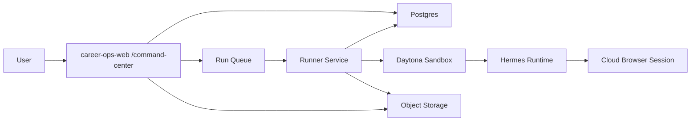

# Career-Ops Cloud Agent Execution — Design Specification

**Date:** 2026-04-22
**Status:** Draft for review
**Scope:** Extend the existing `career-ops-web` command center into a true multi-user cloud execution system where a user can click a mode and have it run in the cloud with full Career-Ops parity, including browser-heavy modes.

---

## 1. Product Goal

Career-Ops already has an effective local agent workflow: compose `modes/_shared.md` plus a selected mode file, add user context, then hand the bundle to a terminal agent or subagent. The current web command center in the `naughty-goldwasser` worktree reproduces that composition and audit trail, but it stops at "prepare and optionally dispatch".

This design upgrades that flow into a production cloud execution platform:

- multi-user from day one
- persistent per-user memory and profile
- fresh isolated worker per run
- full parity from day one for `scan`, `apply`, `auto-pipeline`, and lighter modes
- strict compatibility with the existing Career-Ops mode and data-layer contract
- no final job application submission on the user's behalf

This spec is intentionally scoped to the cloud agent execution layer. It extends the current `command-center` baseline rather than redesigning the entire web product.

### Core Decisions

| Decision | Choice |
|----------|--------|
| Product baseline | Extend the `naughty-goldwasser` `career-ops-web` worktree as source of truth |
| Users | Multi-user from day one |
| Execution model | Persistent user memory/profile, fresh isolated worker per run |
| Browser scope | Full parity from day one, including `scan`, `apply`, and `auto-pipeline` |
| Control plane | Existing `career-ops-web` app, expanded beyond compose-only |
| Agent runtime | Hermes in isolated workers |
| Worker environment | Fresh Daytona sandbox per run |
| Browser runtime | Cloud browser sessions via Hermes browser tooling |
| Canonical user state | Web control plane DB + object storage |
| Career-Ops compatibility | Keep `modes/*`, templates, scripts, and user/system layer rules intact |
| Submission policy | Never submit an application on the user's behalf |

---

## 2. Current Baseline

The source-of-truth branch already provides:

- `Agents` nav entry pointing to `/command-center`
- mode catalog in `lib/career-ops/modes.ts`
- prompt composition in `lib/career-ops/compose-prompt.ts`
- optional webhook dispatch in `lib/career-ops/dispatch.ts`
- `agent_runs` persistence and listing APIs
- a UI that prepares prompt bundles for copy/paste into local tools

That is the correct starting point. The missing capability is actual managed cloud execution with tenancy, orchestration, live status, artifacts, and browser-backed workers.

### Existing Constraints That Must Be Preserved

- Reuse checked-in `modes/_shared.md` and `modes/{mode}.md` instead of creating a parallel prompt system.
- Keep personalization in the user-layer equivalents of `config/profile.yml`, `modes/_profile.md`, `article-digest.md`, and `portals.yml`.
- Preserve the Career-Ops rule that the system may assist with applications but must never submit them.
- Preserve the distinction between system-layer assets and user-layer state.

---

## 3. Architecture Overview

The system is split into five planes:

1. **Control plane**
   The existing Next.js app receives requests, composes runs, stores state, shows live progress, and exposes review/approval controls.

2. **Execution plane**
   A dedicated runner service claims queued jobs, provisions workers, starts Hermes, collects results, and updates run state.

3. **State plane**
   Postgres stores normalized run state, user profile state, and ingested outputs. Object storage stores large artifacts such as logs, screenshots, PDFs, traces, and raw bundle snapshots.

4. **Memory plane**
   Durable user memory and profile live outside workers. Each run receives a generated snapshot of user-specific Career-Ops files.

5. **Browser plane**
   Browser-heavy modes use isolated cloud browser sessions that are scoped to one run and one user.

### Recommended Infrastructure Shape

- `career-ops-web`: Vercel or similar standard Next.js host
- Postgres: Neon
- Object storage: S3-compatible bucket
- Queue + runner service: Fly.io or a small VPS
- Sandboxes: Daytona snapshots
- Browser provider: Hermes browser tooling backed by Browserbase-compatible cloud sessions

This balances implementation speed, operational control, and long-term extensibility without forcing Kubernetes or Temporal on day one.

---

## 4. Repo Compatibility Model

Career-Ops today operates on a repo-shaped workspace. The cloud design must preserve that contract.

### Principle

The canonical user state for the web product is **not** a long-lived worker filesystem. The canonical state lives in the control plane database plus object storage. Workers receive a generated temporary Career-Ops workspace at run start.

### Generated Workspace Shape

Each run materializes a temporary workspace that mirrors the local Career-Ops structure closely enough for existing modes and scripts to work:

- `modes/_shared.md` and `modes/{mode}.md` from the pinned repo revision
- `modes/_profile.md` generated from user profile state
- `config/profile.yml` generated from normalized DB state
- `article-digest.md` generated from durable user content
- `portals.yml` generated from user scanner config
- any required `data/*`, `reports/*`, `output/*`, or `interview-prep/*` inputs for the selected mode

### Why This Boundary Matters

- system-layer files remain versioned with the app/repo
- user-layer content stays tenant-scoped
- fresh workers remain disposable
- current Career-Ops prompts, scripts, and conventions remain usable
- future local and cloud execution stay aligned

---

## 5. Worker Lifecycle

Every run follows the same high-level lifecycle:

1. User clicks `Compose & Run` from `/command-center`.
2. The control plane composes the exact prompt bundle and creates an `agent_run`.
3. The run is enqueued.
4. A runner service claims the job.
5. The runner provisions a fresh Daytona sandbox from a prebuilt snapshot.
6. The runner checks out or mounts the pinned Career-Ops repo revision.
7. The runner generates the user-layer workspace files from control-plane state.
8. The runner starts Hermes with the required toolsets for the selected mode.
9. Hermes executes the mode and emits events, logs, and artifacts.
10. The runner streams progress back to the control plane.
11. Outputs are normalized and ingested into the main app data model.
12. The sandbox and browser session are destroyed.

### Worker Lifecycle Rules

- workers are always fresh per run
- sandboxes are never shared across users
- browser sessions are never shared across users or runs
- runs are pinned to a repo revision for reproducibility
- user context is snapshotted at run start
- all artifacts are attached to the run record

### Sandbox Recommendation

Use Daytona snapshots for run environments that already contain:

- Hermes
- Node dependencies needed by Hermes browser tooling
- required system packages for current Career-Ops scripts
- the pinned `career-ops` repo checkout or bootstrap logic

Daytona is the best fit because it supports isolated sandboxes, explicit lifecycle control, and snapshot-based startup for agent workspaces. Stopped or archived sandboxes can remain a future optimization, but v1 should treat workers as ephemeral and disposable. Source: [Daytona sandboxes](https://www.daytona.io/docs/en/sandboxes/), [Daytona snapshots](https://www.daytona.io/docs/snapshots/).

---

## 6. Hermes Integration Model

Hermes is the recommended agent runtime because it already supports:

- isolated profiles
- persistent memory
- browser automation
- terminal backends including Daytona and Modal
- file and web tools

Sources:

- [Hermes overview](https://hermes-agent.nousresearch.com/docs/)
- [Hermes profiles](https://hermes-agent.nousresearch.com/docs/user-guide/profiles)
- [Hermes browser automation](https://hermes-agent.nousresearch.com/docs/user-guide/features/browser)
- [Hermes tools/toolsets](https://hermes-agent.nousresearch.com/docs/user-guide/features/tools)
- [Hermes Python library](https://hermes-agent.nousresearch.com/docs/guides/python-library)

### Integration Pattern

The Next.js app must not call Hermes directly. Instead:

- the control plane enqueues runs
- the runner provisions the sandbox and starts Hermes
- the runner translates Hermes events into app-level run events

### Preferred Execution Mode

Use Hermes through a thin runner adapter:

- **primary mode:** Hermes as a Python library or structured process wrapper, so the runner can stream events, enforce checkpoints, and normalize results
- **fallback/debug mode:** Hermes CLI inside the sandbox for manual reproduction and operator debugging

### Profile Strategy

Hermes per-user profiles are allowed, but they are not the canonical storage layer. They hold assistant-oriented memory and run-time context. Canonical user data remains in the control plane and is regenerated into the workspace each run.

---

## 7. Data Model

The current `agent_runs` table is the right seed, but it needs to become a real orchestration model.

### Required Tables

#### `agent_runs`

Primary workflow record.

Required fields:

- `id`
- `user_id`
- `mode`
- `status`
- `repo_revision`
- `cli_line`
- `prompt_bundle`
- `subagent_instruction`
- `workspace_bundle_hash`
- `user_notes`
- `sandbox_id`
- `browser_session_id`
- `started_at`
- `finished_at`
- `error_message`
- `cost_usd`
- `created_at`
- `updated_at`

### Run Statuses

Recommended statuses:

- `queued`
- `provisioning`
- `running`
- `waiting_for_user`
- `succeeded`
- `failed`
- `canceled`
- `timed_out`

#### `agent_run_events`

Append-only event timeline for:

- queue claimed
- sandbox created
- browser connected
- mode started
- milestone reached
- review required
- artifact stored
- retry triggered
- run completed
- run failed

#### `agent_run_artifacts`

Pointers to durable files:

- logs
- screenshots
- browser traces
- extracted JD snapshots
- PDFs
- markdown reports
- generated CV outputs

#### `agent_run_inputs`

Frozen execution context:

- exact selected mode
- exact prompt bundle
- selected repo revision
- generated user-layer bundle
- environment profile used
- execution policy flags

#### `agent_run_outputs`

Normalized outputs that the control plane can ingest into:

- `reports`
- `applications`
- `pipeline_entries`
- `follow_ups`
- `story_bank_entries`

### Design Rules

- all important state transitions must be append-only evented
- large blobs belong in object storage, not inline DB columns
- normalized outputs should be queryable without reparsing markdown artifacts
- reruns should keep lineage to prior runs for auditability

---

## 8. Browser Execution and Safety

Full parity from day one means the browser layer is a first-class subsystem.

Hermes supports cloud browser execution with per-task session isolation, which aligns with the fresh-worker model. Source: [Hermes browser automation](https://hermes-agent.nousresearch.com/docs/user-guide/features/browser).

### Mode Risk Levels

#### `scan`

Read-heavy autonomous browsing:

- visit configured company or portal pages
- paginate and expand listings
- extract role data
- collect artifacts

Policy:

- restrict navigation to configured domains and explicitly allowed redirects when possible
- default to read-only behavior

#### `auto-pipeline`

Mixed extraction and downstream processing:

- inspect JD pages
- capture the page content and metadata
- generate report/PDF/tracker outputs

Policy:

- autonomous extraction allowed
- downstream writes are to Career-Ops data structures, not remote sites

#### `apply`

High-risk guided browsing:

- navigate form flows
- inspect fields and requirements
- generate draft answers
- upload prepared materials when allowed by product policy
- fill reversible form fields

Policy:

- the system may prepare an application
- the system must never trigger final submission

### Human-In-The-Loop Apply Flow

`apply` must be modeled as a gated workflow:

- `drafting`
- `review_required`
- `user_approved`
- `final_submit_blocked`

When a run enters `review_required`, the UI must show:

- structured summary of what the worker filled or plans to fill
- screenshots
- relevant artifacts
- explicit next action options

The system may continue only to additional reversible steps after user approval. It must never press the final irreversible submit action.

### Browser Session Rules

- one browser session per run
- no cookie or session sharing across users
- credentials injected only for the required domains
- browser traces and screenshots attached to the run
- session cleanup always runs on success, failure, cancel, or timeout

---

## 9. Tenancy, Secrets, and Isolation

Multi-user support from day one requires strict isolation boundaries.

### Isolation Guarantees

- each run gets its own sandbox
- each run gets its own browser session
- each run gets its own generated workspace
- secrets are injected per run, scoped to the required capability
- no shared mutable workspace across users

### Secrets Model

The control plane stores encrypted credentials for:

- model provider access
- browser provider access
- optional portal credentials
- object storage or downstream integration credentials

The runner receives only the minimum secret set needed for the run and injects them into the sandbox at start. Secrets are not written back into durable workspace files.

### Submission Guardrail

The "never submit on the user's behalf" rule must be implemented as a product policy and runner safeguard, not only as prompt text. The runner must detect and block final submit actions in `apply`.

---

## 10. Reliability Model

This system is long-running and browser-dependent, so orchestration reliability matters.

### Runner Responsibilities

- claim jobs atomically
- heartbeat while a run is active
- renew leases while working
- detect stuck runs
- cancel sandboxes and browser sessions on termination
- write terminal status and error reason deterministically

### Retry Policy

Safe to retry:

- queue claim race failures
- sandbox provisioning failures
- transient browser startup failures
- transient model/API failures before irreversible actions

Not safe to blind-retry:

- ambiguous form interactions in `apply`
- runs after a browser step whose external side effects are unknown

### Timeout Policy

Every mode needs explicit maximum runtime and inactivity thresholds. Browser-heavy modes should have stricter inactivity detection and clearer cancellation UX.

### Idempotency

- every queued run gets a unique run identifier
- artifact uploads use deterministic keys
- output ingestion must tolerate duplicate delivery attempts
- event writes should be append-only and deduplicated by event key where needed

---

## 11. UI and Product Changes

The current `command-center` UI is the right entry point, but it needs to evolve from composition-only into orchestration-aware execution.

### Required UI Changes

- replace "compose prompt bundle" as the primary call to action with "compose and run"
- preserve access to the exact prompt bundle for debugging and trust
- show run status in real time
- show event timeline
- show artifacts as they appear
- surface waiting-for-review states clearly
- support cancel and rerun

### Run Detail View

Each run detail page should show:

- selected mode
- exact repo revision
- generated bundle metadata
- live status
- event timeline
- logs
- screenshots and traces
- normalized outputs
- errors and retry context

### Apply Review UX

For `apply`, the run detail page must surface:

- what fields were filled
- what files were uploaded
- what remains blocked
- clear confirmation controls for reversible continuation
- a clear statement that final submission remains blocked

---

## 12. Testing Strategy

The design needs three layers of verification.

### 1. Contract Tests

Validate:

- prompt composition
- workspace generation from DB state
- repo revision pinning
- output normalization

### 2. Integration Tests

Validate:

- queue to runner handoff
- sandbox lifecycle
- browser session lifecycle
- status transitions
- artifact persistence

Use fake or mock adapters where appropriate for the sandbox and browser providers.

### 3. Canary End-to-End Tests

Run against:

- a stable sample of careers pages
- a controlled mock application form
- representative non-browser modes

These tests should confirm that:

- `scan` can discover and normalize postings
- `auto-pipeline` can extract a JD and produce the expected downstream outputs
- `apply` can navigate and draft safely without submitting

---

## 13. Rollout Plan

Although browser parity is required for the first public release, implementation should still be staged internally behind flags.

### Recommended Rollout Order

1. Internal queue + runner + fresh sandbox lifecycle
2. Non-browser modes in cloud
3. `auto-pipeline` with browser extraction
4. `scan`
5. `apply` with review gates and hard submit block
6. full live logs, artifacts, and operator tooling

This preserves the single architecture while reducing build risk. Public release remains gated on all required modes being available in cloud execution.

---

## 14. Out of Scope

This spec does not define:

- billing or pricing changes
- a generalized job queue platform for unrelated workloads
- long-lived shared collaborative sandboxes
- fully autonomous job application submission
- unrelated redesign of the broader Career-Ops web UI

---

## 15. Final Recommendation

Build a true cloud execution platform by extending the existing `command-center` baseline into a control plane plus dedicated runner architecture:

- keep `career-ops-web` as the control plane
- replace webhook dispatch with a first-class internal queue
- use a long-lived runner service
- run Hermes in fresh Daytona sandboxes
- use isolated cloud browser sessions for browser-heavy modes
- keep canonical user state in the control plane, not in worker filesystems
- generate a Career-Ops-compatible workspace per run
- preserve the existing mode files and user/system-layer contract
- enforce the no-submit rule in product logic, not just prompts

This is the fastest path to true "click → agent runs in the cloud" without discarding the Career-Ops architecture that already works locally.
