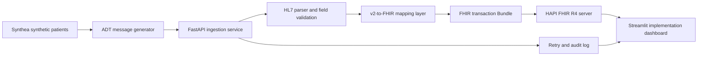

# FHIR-based patient care integration platform

## Project verdict

**BUILD: 4.6/5 portfolio value**

| Dimension | Score | Reason |
|---|---:|---|
| Signal for target roles | 5.0 | Direct evidence for HealthTech implementation, Solutions Engineer, and healthcare AI roles |
| Uniqueness | 4.2 | Stronger than a generic CRUD or chatbot project |
| Demo ability | 4.8 | A raw ADT message can become linked FHIR resources in under 2 minutes |
| Metrics potential | 4.5 | Mapping coverage, validation pass rate, API latency, retry recovery, and test coverage |
| Time to MVP | 4.2 | Core path is realistic in 7–10 focused days |
| STAR story potential | 4.8 | Clear requirements, mapping decisions, failures, validation, and trade-offs |

## What the finished demo proves

The demo accepts an HL7 v2 ADT message, extracts clinical and administrative fields, maps them into FHIR R4 resources, validates the output, and posts a transaction Bundle to a local HAPI FHIR server. A Streamlit screen shows the source message, conversion status, linked resources, validation errors, and retry history.

Use synthetic data only. Do not use real patient information.

## Architecture



## Scope boundary

### MVP

- ADT A01 admission message
- PID to Patient
- PV1 to Encounter
- DG1 to Condition
- OBX to Observation
- FHIR transaction Bundle
- HAPI FHIR R4 server
- FastAPI endpoint protected by a bearer token
- Input checks, FHIR validation, retry handling, tests, and dashboard

### Later additions

- ADT A03 discharge and A08 demographic update
- Conditional create to prevent duplicate patients
- SMART on FHIR authorization
- US Core profiles
- PostgreSQL for HAPI FHIR
- Dead-letter queue and message replay
- OpenTelemetry traces

Keep these out of the first build. The MVP already contains enough signal.

## Prerequisites

- Docker Desktop
- Python 3.11+
- Git
- 8–12 GB free disk space
- Basic Python, JSON, HTTP, and pytest knowledge

Recommended Python packages:

```text
fastapi
uvicorn[standard]
httpx
pydantic
python-multipart
pyjwt
pwdlib[argon2]
tenacity
streamlit
pytest
pytest-cov
```

## Repository structure

```text
fhir-patient-care-integration/
├── README.md
├── docker-compose.yml
├── requirements.txt
├── .env.example
├── app/
│   ├── main.py
│   ├── config.py
│   ├── auth.py
│   ├── schemas.py
│   ├── hl7_parser.py
│   ├── mapper.py
│   ├── bundle.py
│   ├── fhir_client.py
│   └── audit.py
├── dashboard/
│   └── streamlit_app.py
├── data/
│   ├── hl7/
│   └── synthea/
├── scripts/
│   ├── generate_synthea.sh
│   ├── make_adt_messages.py
│   └── seed_hapi.py
├── tests/
│   ├── fixtures/
│   ├── test_parser.py
│   ├── test_mapper.py
│   ├── test_api.py
│   └── test_retry.py
└── docs/
    ├── architecture.md
    ├── mapping-table.md
    ├── implementation-guide.md
    └── postmortem.md
```

## Lab 1: start HAPI FHIR

Create `docker-compose.yml`:

```yaml
services:
  hapi:
    image: hapiproject/hapi:latest
    ports:
      - "8080:8080"
```

Run:

```bash
docker compose up -d
curl http://localhost:8080/fhir/metadata
```

Completion check: the second command returns a FHIR `CapabilityStatement`.

## Lab 2: generate synthetic patients

Clone Synthea next to the project or place it under a local tools directory:

```bash
git clone https://github.com/synthetichealth/synthea.git
cd synthea
./run_synthea -p 10 --exporter.fhir.export=true
```

Copy 10 generated FHIR R4 JSON files into `data/synthea/`.

Synthea produces FHIR records directly. For this project, use those records as the synthetic source of patient demographics and clinical events, then generate sample ADT messages from them. Document this simulation step in the README.

Completion check: `data/synthea/` contains synthetic FHIR Bundles with Patient and Encounter entries.

## Lab 3: learn one ADT message

Start with one fixture in `tests/fixtures/adt_a01.hl7`:

```text
MSH|^~\&|SYNTHETIC_EHR|HOSPITAL|INTEGRATION_API|DEMO|20260701103000||ADT^A01|MSG00001|P|2.5
EVN|A01|20260701103000
PID|1||SYN-1001^^^HOSPITAL^MR||Doe^Jane||19850514|F|||100 Main St^^Pittsburgh^PA^15213||5551234567
PV1|1|I|WARD^101^A||||1234^Smith^Alex|||||||||||ENC-9001|||||||||||||||||||||||||20260701103000
DG1|1||I10^Essential hypertension^ICD-10-CM|||A
OBX|1|NM|8480-6^Systolic blood pressure^LN||138|mm[Hg]|90-120|H|||F
```

Map the segments:

| HL7 v2 field | FHIR target |
|---|---|
| `PID-3` | `Patient.identifier` |
| `PID-5` | `Patient.name` |
| `PID-7` | `Patient.birthDate` |
| `PID-8` | `Patient.gender` |
| `PID-11` | `Patient.address` |
| `PV1-2` | `Encounter.class` |
| `PV1-3` | `Encounter.location` |
| `PV1-19` | `Encounter.identifier` |
| `PV1-44` | `Encounter.period.start` |
| `DG1-3` | `Condition.code` |
| `OBX-3` | `Observation.code` |
| `OBX-5` | `Observation.valueQuantity.value` |
| `OBX-6` | `Observation.valueQuantity.unit` |

Completion check: write parser tests that assert the extracted values for every row above.

## Lab 4: build the parser

Implement `parse_message(raw: str) -> ParsedADT` in `app/hl7_parser.py`.

Required behavior:

- Normalize `\r`, `\n`, and Windows line endings.
- Split segments by segment terminator.
- Reject messages without MSH, PID, or PV1.
- Confirm `MSH-9` begins with `ADT^A01`.
- Store unknown segments without failing.
- Return a typed Pydantic object.

Do not hide mapping logic behind a large library in the first version. A small parser makes the field-level decisions visible during interviews.

Completion check: malformed input returns a clear error naming the missing segment or field.

## Lab 5: map ADT to FHIR

Implement these functions in `app/mapper.py`:

```python
def patient_from_pid(parsed): ...
def encounter_from_pv1(parsed, patient_ref): ...
def conditions_from_dg1(parsed, patient_ref, encounter_ref): ...
def observations_from_obx(parsed, patient_ref, encounter_ref): ...
```

Use `urn:uuid:` identifiers inside the transaction Bundle so Encounter, Condition, and Observation can reference the Patient before HAPI assigns persistent IDs.

Set at least:

- `Patient.identifier`, `name`, `birthDate`, `gender`, and `address`
- `Encounter.status`, `class`, `subject`, `period`, and identifier
- `Condition.clinicalStatus`, `verificationStatus`, `code`, `subject`, and encounter
- `Observation.status`, `category`, `code`, `subject`, `encounter`, and `valueQuantity`

Completion check: every generated resource has `resourceType`, required fields, and resolvable references.

## Lab 6: create and submit a transaction Bundle

Build one Bundle with `type: transaction`. Each entry needs a resource and request instructions. Post the Bundle to the FHIR base URL, not `/Bundle`:

```bash
curl -X POST http://localhost:8080/fhir \
  -H 'Content-Type: application/fhir+json' \
  --data @data/example-transaction.json
```

Use conditional creates for the Patient and Encounter when the identifiers are stable:

```json
{
  "request": {
    "method": "POST",
    "url": "Patient",
    "ifNoneExist": "identifier=http://hospital.example/mrn|SYN-1001"
  }
}
```

Completion check: one request creates linked Patient, Encounter, Condition, and Observation resources. Submitting the same event twice must not create another Patient.

## Lab 7: build the FastAPI service

Required endpoints:

```text
POST /token
POST /ingest/adt
GET  /messages/{message_id}
POST /messages/{message_id}/retry
GET  /health
```

`POST /ingest/adt` should:

1. Authenticate the caller.
2. Save the message ID and receipt time.
3. Parse the ADT message.
4. Create FHIR resources and a transaction Bundle.
5. Request validation from HAPI FHIR.
6. Post the transaction.
7. Save status, latency, attempt count, returned resource IDs, and errors.

Never log names, addresses, or raw messages in production-style logs. This project uses synthetic data, but the logging design should still demonstrate privacy awareness.

Completion check: Swagger UI at `http://localhost:8000/docs` can authenticate and ingest a fixture.

## Lab 8: add authentication, validation, and retries

Use FastAPI's OAuth2 password flow and signed JWT access tokens for the demo boundary. Keep secrets in environment variables.

Validation layers:

- Pydantic checks for API input and internal parser output
- Required HL7 segment and field checks
- FHIR `$validate` or HAPI instance validation before persistence
- Transaction-response inspection after persistence

Retry only temporary failures such as connection errors, timeouts, HTTP 429, and HTTP 5xx. Do not retry malformed messages or FHIR validation failures.

Recommended retry schedule: 1, 2, and 4 seconds with a maximum of 3 attempts.

Completion check: a simulated HAPI outage records 3 attempts and succeeds after the server returns. A malformed PID fails once with a useful error.

## Lab 9: build the Streamlit dashboard

Pages or tabs:

- **Overview:** received, converted, failed, retried, validation pass rate
- **Message detail:** de-identified source fields, mapping steps, created resource IDs
- **FHIR browser:** Patient with linked Encounter, Condition, and Observation
- **Failures:** validation errors, attempt history, and replay action

The 2-minute demo should show:

1. An ADT A01 message.
2. Successful ingestion through FastAPI.
3. The transaction response.
4. Linked FHIR resources in HAPI.
5. One failed message and its error explanation.

## Lab 10: test and measure

Minimum tests:

- Parser handles A01 and line-ending variants.
- Parser rejects missing MSH, PID, and PV1.
- PID fields map correctly to Patient.
- PV1 fields map correctly to Encounter.
- DG1 and OBX produce linked resources.
- Transaction Bundle contains unique `fullUrl` values.
- API rejects missing or expired tokens.
- API does not retry a validation error.
- API retries a temporary HAPI failure.
- Duplicate submission does not create another Patient.

Track these metrics:

| Metric | MVP target |
|---|---:|
| Valid fixture conversion | 100% |
| FHIR validation pass rate | 100% for supported fields |
| Duplicate Patient rate | 0% across replay tests |
| Automated tests | 20+ |
| Mapping coverage | 12+ documented HL7 fields |
| Median local conversion latency | Measure, do not preselect a number |
| Retry recovery | Demonstrate 1 temporary-failure scenario |

Do not place a metric on the résumé until the test or benchmark produces it.

## 2-week schedule

### Week 1: working data path

- Day 1: HAPI FHIR and Synthea
- Day 2: ADT fixture and mapping table
- Day 3: parser and parser tests
- Day 4: FHIR resource mapper
- Day 5: transaction Bundle and HAPI persistence
- Day 6: FastAPI ingestion endpoint
- Day 7: integration tests and cleanup

### Week 2: product and interview pack

- Day 8: JWT authentication
- Day 9: validation and retry policy
- Day 10: audit records and failure replay
- Day 11: Streamlit dashboard
- Day 12: test coverage and benchmark
- Day 13: architecture diagram, README, and postmortem
- Day 14: 2-minute demo recording and résumé bullet

## Interview pack

### One-pager

Include:

- Problem: hospitals exchange event data in older message formats while application teams consume FHIR APIs.
- User: implementation engineer monitoring ADT conversion and delivery.
- Architecture: one diagram with every component and trust boundary.
- Mapping table: each supported v2 field and FHIR path.
- Failure policy: retryable vs permanent failures.
- Metrics: measured test, validation, duplicate, and latency results.

### Postmortem prompts

- Which HL7 v2 fields were ambiguous?
- Why use a transaction Bundle?
- How did you preserve resource references before IDs existed?
- Which errors were safe to retry?
- How did you prevent duplicate patients?
- What would change for real protected health information?
- Why is demo JWT different from production SMART on FHIR?

## Résumé bullet gate

Use this only after every stated capability works:

> Built a healthcare interoperability platform that ingested HL7 v2 ADT messages, mapped clinical events to FHIR R4 Patient, Encounter, Observation, and Condition resources, and exchanged linked resources through FastAPI and HAPI FHIR REST APIs. Added validation, authentication, retry handling, and automated tests for message failures and duplicate prevention.

After measuring the system, add one verified metric such as test count, validation pass rate, supported field count, or local latency.

## Official references

- [Synthea documentation](https://synthetichealth.github.io/synthea/)
- [Synthea repository and run instructions](https://github.com/synthetichealth/synthea)
- [HAPI FHIR JPA starter](https://hapifhir.io/hapi-fhir/docs/server_jpa/get_started.html)
- [HAPI FHIR Docker starter](https://github.com/hapifhir/hapi-fhir-jpaserver-starter)
- [FHIR R4 REST API](https://hl7.org/fhir/R4/http.html)
- [FHIR R4 Bundle](https://hl7.org/fhir/R4/bundle.html)
- [FHIR R4 Patient](https://hl7.org/fhir/R4/patient.html)
- [FHIR R4 Encounter](https://hl7.org/fhir/R4/encounter.html)
- [FHIR R4 Observation](https://hl7.org/fhir/R4/observation.html)
- [FHIR R4 Condition](https://hl7.org/fhir/R4/condition.html)
- [HAPI FHIR instance validation](https://hapifhir.io/hapi-fhir/docs/validation/instance_validator.html)
- [FastAPI OAuth2 and JWT](https://fastapi.tiangolo.com/tutorial/security/oauth2-jwt/)
- [FastAPI testing](https://fastapi.tiangolo.com/tutorial/testing/)
